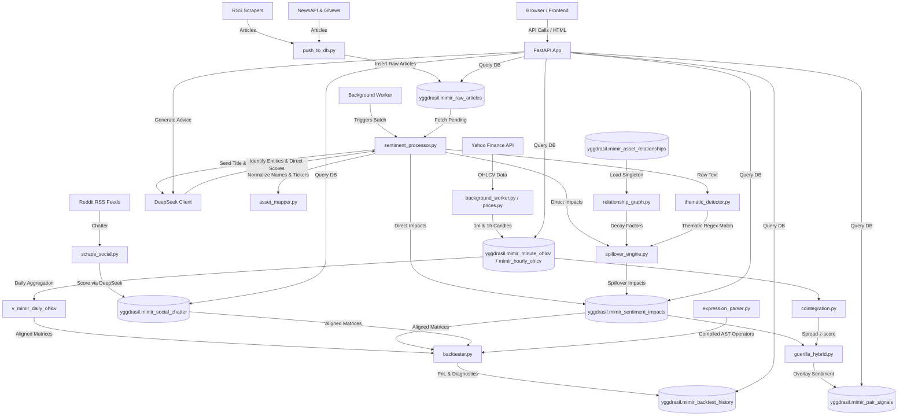

# 🌳 MIMIR: Market Intelligence & Macroeconomic Indicator Reactor

Welcome to **MIMIR** (Market Intelligence & Macroeconomic Indicator Reactor), a real-time market intelligence pipeline, macroeconomic sentiment analyzer, statistical arbitrage engine, and **quantitative strategy backtester**.

This repository is designed to be easily navigated and understood by both **human developers** and **web-based LLM assistants** (e.g., ChatGPT, Claude, Gemini) to enable rapid project context bootstrapping and seamless pair programming.

---

## 🎯 Core Mission & Trading Edge

MIMIR provides structural trading edges by identifying:
1. **Niche Sentiment Arbitrage**: Spotting discrepancies between news/social sentiment momentum and price action before retail channels react.
2. **Capacity-Constrained Opportunities**: Capitalizing on smaller, low-liquidity, or specialized assets (e.g., small-cap equities, localized commodity spreads, niche crypto tokens) where large hedge funds cannot trade because their large capital size would cause excessive market impact.
3. **Multi-Factor Signal Fusion**: Combining real-time sentiment catalyst indicators, technical analysis setups, and Corporate Fundamentals to filter out false breakouts and back high-probability setups.
4. **Self-Funding / Operational Efficiency**: Generating enough reliable alpha yields to fully offset operational API expenses (such as DeepSeek token consumption and premium data feeds).
5. **Medium-Term Execution Horizon**: MIMIR is NOT designed for High-Frequency Trading (HFT); rather, it aims to exploit medium-term market inefficiencies (spanning hours to days).

---

## 🗺️ System Architecture & Data Flow

Below is the diagram illustrating the end-to-end data flow:



---

## 📂 Codebase Directory & File Reference

Use this directory map to understand exactly where features live and what each script does.

### 📁 Backend Core (`backend/app/`)

* [main.py](file:///backend/app/main.py)
  * **Role**: FastAPI application entry point.
  * **Key Functions**: Mounts static directories, configures template rendering engines, registers all system routers, and initializes background thread pipelines (such as price fetching and news scanning daemon runs).
* [config.py](file:///backend/app/config.py)
  * **Role**: Application settings and configuration manager.
  * **Key Functions**: Loads configuration properties from `.env` or system environment variables using `pydantic-settings` to enforce validation.
* [database.py](file:///backend/app/database.py)
  * **Role**: PostgreSQL database connection pooler.
  * **Key Functions**: Exposes database connection resources, context managers, and raw cursor execution loops (optimized via `psycopg2.extras.RealDictCursor`).

---

### 📁 Quantitative & Statistical Analytics (`backend/app/analytics/`)

* [backtester.py](file:///backend/app/analytics/backtester.py)
  * **Role**: Vectorized strategy simulation engine.
  * **Key Functions**: Loads aligned price and sentiment matrices, executes strategy weights, simulates timezone-aligned market executions, deducts trading slippage fees, enforces survivorship masks, and calculates key statistics (Sharpe Ratio, Win Rate, Turnover, Drawdowns, Information Coefficient, and Fitness).
* [expression_parser.py](file:///backend/app/analytics/expression_parser.py)
  * **Role**: Secure AST (Abstract Syntax Tree) formula compiler.
  * **Key Functions**: Parses mathematical strings into Pandas-vectorized operations. Supports cross-sectional rankings, rolling regressions, logical conditionals (`if_else`), decay calculations, and custom math functions.
* [cointegration.py](file:///backend/app/analytics/cointegration.py)
  * **Role**: Statistical Cointegration modeler.
  * **Key Functions**: Evaluates price pairs, calculates Engle-Granger two-step cointegration, computes rolling hedge ratios, and evaluates spread z-scores.
* [guerilla_hybrid.py](file:///backend/app/analytics/guerilla_hybrid.py)
  * **Role**: Cointegration spread and sentiment overlay synthesizer.
  * **Key Functions**: Combines statistical spread z-scores with LLM sentiment data to dynamically score and filter trade setups.
* [performance_evaluator.py](file:///backend/app/analytics/performance_evaluator.py)
  * **Role**: Metric calculation utility.
  * **Key Functions**: Computes Sharpe ratios, annualized returns, max drawdowns, information coefficients, and general validation checks.
* [signal_fusion.py](file:///backend/app/analytics/signal_fusion.py)
  * **Role**: Multi-factor signal combiner.
  * **Key Functions**: Normalizes and fuses technical indicator metrics, corporate fundamentals, and news sentiment scores into unified conviction scales.
* [technical_analysis.py](file:///backend/app/analytics/technical_analysis.py)
  * **Role**: Vectorized technical indicator computer.
  * **Key Functions**: Calculates RSI, moving averages (EMA/SMA), Bollinger Bands, and support/resistance zones using Pandas.

---

### 📁 Data Pipelines (`backend/app/pipeline/`)

* [background_worker.py](file:///backend/app/pipeline/background_worker.py)
  * **Role**: Asynchronous task orchestrator.
  * **Key Functions**: Manages background loop triggers (such as polling pricing feeds and scraping financial sites every 5 minutes).
* [sentiment_processor.py](file:///backend/app/pipeline/sentiment_processor.py)
  * **Role**: Batch news sentiment scoring pipeline.
  * **Key Functions**: Extracts unscored news items from the database, dispatches text to LLM endpoints, runs asset mapping, and inserts sentiment scores back to the database.
* [spillover_engine.py](file:///backend/app/pipeline/spillover_engine.py)
  * **Role**: Sentiment spillover propagator.
  * **Key Functions**: Propagates sentiment scores from direct asset occurrences to related companies using decay factors and theme rules defined in the network graph.

---

### 📁 Sentiment & NLP Engine (`backend/app/sentiment/`)

* [asset_mapper.py](file:///backend/app/sentiment/asset_mapper.py)
  * **Role**: Text entity entity-to-ticker resolver.
  * **Key Functions**: Maps company names, alternative names, and raw strings to standardized financial market tickers.
* [deepseek_client.py](file:///backend/app/sentiment/deepseek_client.py)
  * **Role**: Structured LLM communication interface.
  * **Key Functions**: Formulates structured system prompts and parses JSON outputs from DeepSeek APIs.
* [llm_client.py](file:///backend/app/sentiment/llm_client.py)
  * **Role**: LLM routing layer.
  * **Key Functions**: Handles fallbacks, retries, and API configuration mappings across providers (DeepSeek, Groq, OpenRouter, NVIDIA).
* [relationship_graph.py](file:///backend/app/sentiment/relationship_graph.py)
  * **Role**: Asset dependency network mapping tool.
  * **Key Functions**: Builds and queries direct relationships (supply chain partners, competitors, parent-subsidiary) to feed the spillover propagation engine.
* [thematic_detector.py](file:///backend/app/sentiment/thematic_detector.py)
  * **Role**: Macroeconomic indicator scanner.
  * **Key Functions**: Scans texts for macro themes (inflation, rate decisions, regulatory shifts) and triggers systemic spillover events.

---

### 📁 Ingestion Scrapers (`backend/app/scrapers/`)

* [rss_scraper.py](file:///backend/app/scrapers/rss_scraper.py)
  * **Role**: General news ingestion parser.
  * **Key Functions**: Downloads and parses articles from major financial publications' RSS feeds.
* [newsapi_scraper.py](file:///backend/app/scrapers/newsapi_scraper.py)
  * **Role**: Direct NewsAPI client.
  * **Key Functions**: Fetches target breaking articles using NewsAPI query definitions.
* [niche_sources.py](file:///backend/app/scrapers/niche_sources.py)
  * **Role**: Niche and custom RSS source definitions parser.
  * **Key Functions**: Integrates specialized feeds (e.g. localized commodities, specialized technology sectors).

---

### 📁 FastAPI Routing Controllers (`backend/app/routers/`)

* [backtest.py](file:///backend/app/routers/backtest.py)
  * **Role**: Quantitative simulation endpoint handler.
  * **Key Functions**: Runs quantitative formula simulations (`POST /run`) and retrieves history log tables (`GET /history`).
* [portfolio.py](file:///backend/app/routers/portfolio.py)
  * **Role**: Shadow portfolio ledger tracker.
  * **Key Functions**: Manages transactions (buy/sell orders), retrieves portfolio valuations, calculates realized/unrealized P&L, and fetches AI-driven investment recommendations.
* [prices.py](file:///backend/app/routers/prices.py)
  * **Role**: Price feed endpoint controller.
  * **Key Functions**: Resolves candle charts, asset lists, heatmaps, and queries ticker prices.
* [sentiment.py](file:///backend/app/routers/sentiment.py)
  * **Role**: Sentiment tracking dashboard API.
  * **Key Functions**: Exposes sentiment metrics, aggregates score curves, and returns article analysis reports.
* [articles.py](file:///backend/app/routers/articles.py)
  * **Role**: Scraped news feeds pagination controller.
  * **Key Functions**: Provides paginated list views of news records with search and filtration filters.
* [niche.py](file:///backend/app/routers/niche.py)
  * **Role**: Cointegration and Guerilla Quant views router.
  * **Key Functions**: Retrieves pair relationships, historical spreads, and real-time trade signals.
* [taxonomy.py](file:///backend/app/routers/taxonomy.py)
  * **Role**: Entity mapping config helper.
  * **Key Functions**: Supports CRUD adjustments for name-to-ticker mapping.
* [trade_alerts.py](file:///backend/app/routers/trade_alerts.py)
  * **Role**: Trade alert signal generator.
  * **Key Functions**: Monitors technical triggers (e.g. RSI extremes or MACD crossovers) and posts alerts.
* [refresh.py](file:///backend/app/routers/refresh.py)
  * **Role**: Real-time event broker (SSE).
  * **Key Functions**: Streams real-time pipeline status updates and progress tracking to the front-end dashboard.

---

### 📁 Scripts Directory (`scripts/`)

* [run_full_pipeline.py](file:///scripts/run_full_pipeline.py)
  * **Role**: Master CLI pipeline executor.
  * **Key Functions**: Initiates a synchronous run of the entire pipeline: scrapes news, runs sentiment analysis, applies spillovers, and updates database records.
* [run_price_fetch.py](file:///scripts/run_price_fetch.py)
  * **Role**: Independent price downloader script.
  * **Key Functions**: Pulls historical price feeds from Yahoo Finance and updates Postgres tables.
* [scrape_social.py](file:///scripts/scrape_social.py)
  * **Role**: Social sentiment crawler.
  * **Key Functions**: Scrapes designated Subreddits via RSS feeds using `curl_cffi` to avoid rate limits, scores raw text using DeepSeek, and writes outputs to social tables.
* [scrape_twitter.py](file:///scripts/scrape_twitter.py)
  * **Role**: Dedicated Twitter scraper mockup/client.
  * **Key Functions**: Processes raw Twitter feeds to extract sentiment insights.
* [push_to_db.py](file:///scripts/push_to_db.py)
  * **Role**: Article database importer utility.
  * **Key Functions**: Ingests raw parsed articles and hashes content to avoid duplicate inserts.
* [fetch_fundamentals.py](file:///scripts/fetch_fundamentals.py)
  * **Role**: Fundamental data extractor.
  * **Key Functions**: Downloads balance sheets and income statement metrics for the active asset universe.
* [tune_ticker_parameters.py](file:///scripts/tune_ticker_parameters.py)
  * **Role**: Trading strategy parameters optimizer.
  * **Key Functions**: Tunes asset indicators (e.g. RSI lookback periods or Z-score limits) using historical performance feedback.
* [test_wq_operators.py](file:///scripts/test_wq_operators.py)
  * **Role**: Unit tests for parser math operators.
* [test_backtest.py](file:///scripts/test_backtest.py)
  * **Role**: Backtest engine validator tests.
* [test_portfolio_advice.py](file:///scripts/test_portfolio_advice.py)
  * **Role**: Portfolio validation and ledger unit tests.

---

### 📁 Frontend Templates (`frontend/templates/`)

* [base.html](file:///frontend/templates/base.html): Base shell providing unified navigation and global JS event listeners.
* [index.html](file:///frontend/templates/index.html): Main dashboard displaying high-level sentiment feeds and macro graphs.
* [articles.html](file:///frontend/templates/articles.html): Article explorer for viewing raw articles and direct sentiment impacts.
* [social.html](file:///frontend/templates/social.html): Social dashboard displaying Reddit and forum indicators.
* [finance.html](file:///frontend/templates/finance.html): Detail page for specific assets showing prices, signals, and news history.
* [portfolio.html](file:///frontend/templates/portfolio.html): Shadow portfolio ledger interface displaying returns, P&L graphs, and AI advice.
* [backtest.html](file:///frontend/templates/backtest.html): Interactive quant formula testing simulator.
* [alphas.html](file:///frontend/templates/alphas.html): Alpha formula catalog containing pre-built strategies.
* [guerilla.html](file:///frontend/templates/guerilla.html): Cointegration spread monitoring and signal dashboard.
* [map.html](file:///frontend/templates/map.html): Relationship network graph visualizer.
* [taxonomy.html](file:///frontend/templates/taxonomy.html): Name-to-ticker mapping manager.
* [alerts.html](file:///frontend/templates/alerts.html): Technical signal alert log.

---

## 🗄️ Database Schema Reference

All tables reside within the `yggdrasil` schema of PostgreSQL:

1. **`mimir_raw_articles`**: Raw articles scraped from news RSS feeds.
   * `id` (SERIAL PRIMARY KEY)
   * `title` (TEXT), `summary` (TEXT), `url` (TEXT)
   * `published_ts` (TIMESTAMPTZ)
   * `url_hash` (VARCHAR), `title_hash` (VARCHAR)
   * `scoring_status` (VARCHAR - default 'pending')
2. **`mimir_sentiment_impacts`**: Output sentiment scores calculated by the LLM.
   * `id` (SERIAL PRIMARY KEY)
   * `article_id` (INTEGER REFERENCES mimir_raw_articles)
   * `asset_name` (VARCHAR), `ticker` (VARCHAR)
   * `sentiment_score` (NUMERIC from -1.0 to 1.0)
   * `direction` (VARCHAR - 'positive', 'neutral', 'negative')
   * `is_spillover` (BOOLEAN - indicates if propagated via spillover engine)
3. **`mimir_social_chatter`**: Social forum chatter records.
   * `id` (SERIAL PRIMARY KEY)
   * `source` (VARCHAR - e.g., 'reddit')
   * `title` (TEXT), `body` (TEXT), `author` (VARCHAR)
   * `sentiment_score` (NUMERIC), `ticker` (VARCHAR)
   * `url` (TEXT), `created_at` (TIMESTAMPTZ)
4. **`mimir_minute_ohlcv` & `mimir_hourly_ohlcv`**: High-frequency asset price ticks.
   * `timestamp` (TIMESTAMPTZ PRIMARY KEY)
   * `ticker` (VARCHAR PRIMARY KEY)
   * `open`, `high`, `low`, `close` (NUMERIC)
   * `volume` (NUMERIC)
5. **`mimir_portfolio`**: Active ledger recording user asset holdings.
   * `id` (SERIAL PRIMARY KEY)
   * `ticker` (VARCHAR)
   * `order_date` (TIMESTAMPTZ)
   * `buy_price` (NUMERIC)
   * `quantity` (NUMERIC)
   * `transaction_type` (VARCHAR - 'BUY' or 'SELL')
   * `fee` (NUMERIC)
6. **`mimir_backtest_history`**: Quant strategy simulation results.
   * `id` (SERIAL PRIMARY KEY)
   * `formula` (TEXT), `universe` (VARCHAR), `style` (VARCHAR)
   * `start_date` (DATE), `end_date` (DATE)
   * `holding_period` (INTEGER), `slippage_bps` (NUMERIC)
   * `sharpe`, `annualized_return`, `max_drawdown`, `turnover`, `fitness`, `win_rate`, `ic` (NUMERIC)

---

## ⚡ Tech Stack

* **Backend**: FastAPI (Python 3.10+) served via Uvicorn.
* **Database**: PostgreSQL (using TimescaleDB extensions for compressed time-series candle tables).
* **Data Access**: High-performance raw SQL queries via `psycopg2` using connection pooling.
* **Math / Vectorization**: Pandas, NumPy, and Statsmodels.
* **Scraping Clients**: Resilient `curl_cffi` HTTP client sessions to spoof browser parameters and bypass rate-limiting.
* **Frontend**: Jinja2 HTML templates, styled with Tailwind CSS and Vanilla CSS, dynamic visualizations via Chart.js, and real-time updates via Server-Sent Events (SSE).

---

## 🚀 Getting Started

### 1. Installation & Environment Config
```bash
git clone <repository_url>
cd MIMIR-new
python -m venv .venv
source .venv/bin/activate  # On Windows: .venv\Scripts\activate
pip install -r requirements.txt
```

Create a `.env` file in the root workspace directory:
```ini
DB_HOST=localhost
DB_PORT=5432
DB_NAME=pantheon_db
DB_USER=postgres
DB_PASSWORD=your_password
MIMIR_SCHEMA=yggdrasil

DEEPSEEK_API_KEY=your_deepseek_key
OPENROUTER_API_KEY=your_openrouter_key
NEWSAPI_KEY=your_newsapi_key
GNEWS_API_KEY=your_gnews_key
MIMIR_MODE=standalone
```

### 2. Seeding & Running
```bash
# Seed initial asset lists, price candles, and relationships
python scripts/seed_niche_assets.py
python scripts/seed_asset_relationships.py
python scripts/backfill_hourly_ohlcv.py

# Launch FastAPI web app locally (Hot reload enabled)
uvicorn backend.app.main:app --host 0.0.0.0 --port 8000 --reload
```
Open `http://localhost:8000` to view the interactive dashboard.

---

## 🛠️ How to Extend MIMIR (Guide for LLMs & Developers)

### 1. Adding a New Math Operator
To introduce a new WorldQuant formula operator (e.g. `ts_std`):
1. Open [expression_parser.py](file:///backend/app/analytics/expression_parser.py).
2. Register the operator token name under `_eval_function()`.
3. Implement the vectorized calculation using Pandas rolling helpers:
   ```python
   elif func_name == "ts_std":
       arg = self._evaluate_node(node.args[0])
       window = int(self._evaluate_node(node.args[1]))
       return arg.rolling(window, min_periods=1).std()
   ```
4. Add the documentation cheat sheet in [backtest.html](file:///frontend/templates/backtest.html).

### 2. Adding a New Data Feed Variable
To introduce new metrics to the backtester (e.g., *dividend yields*):
1. Load the data table in `BacktestEngine.load_data()` inside [backtester.py](file:///backend/app/analytics/backtester.py).
2. Pivot the table so that rows match timestamps and columns match tickers.
3. Save the matrix into the data registry dictionary:
   ```python
   self.dfs['dividend_yield'] = pivoted_div_df
   ```
4. The formula parser will automatically allow utilizing `dividend_yield` inside trading formulas.