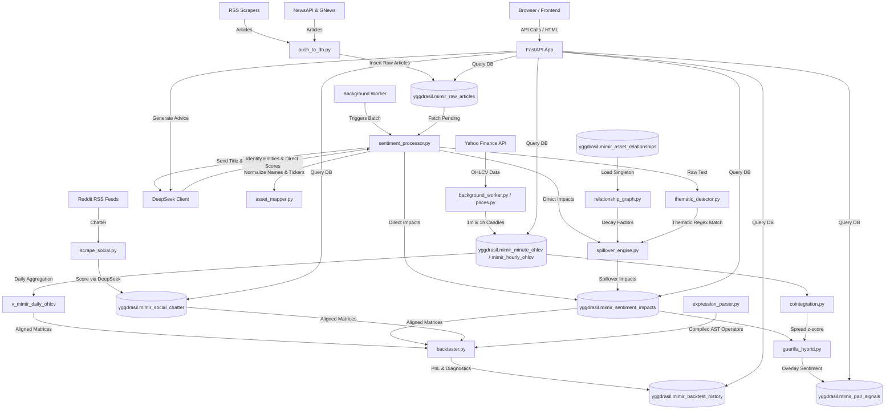

# 🌳 MIMIR: Market Intelligence & Macroeconomic Indicator Reactor

Welcome to **MIMIR** (Market Intelligence & Macroeconomic Indicator Reactor), a real-time market intelligence pipeline, macroeconomic sentiment analyzer, statistical arbitrage engine, and **quantitative strategy backtester**. 

This document serves as a comprehensive developer guide and system documentation. It explains how the codebase is structured, how data flows, how the database schema works, how to use the APIs, and how future developers can seamlessly maintain, run, and expand MIMIR.

---

## 🗺️ System Architecture

The diagram below illustrates how raw news, social chatter, and market prices are ingested, processed through AI and statistical modules, cached in PostgreSQL, and served via the FastAPI web interface.



---

## 🛠️ Tech Stack

MIMIR is built on a high-performance, lightweight developer stack:

1. **Backend Server**: [FastAPI](https://fastapi.tiangolo.com/) served via [Uvicorn](https://www.uvicorn.org/) (ASGI).
2. **Database**: PostgreSQL (using the `yggdrasil` schema). Supported by [TimescaleDB](https://www.timescale.com/) for high-throughput time-series compression of 1-minute price ticks.
3. **Database Driver**: Raw SQL execution via `psycopg2` and `RealDictCursor` for high performance and minimal ORM overhead.
4. **Natural Language Processing (NLP) / LLM**: 
   - [DeepSeek API](https://api.deepseek.com/) for multi-asset sentiment scoring and semantic analysis.
5. **Data Feeds & Scraping**:
   - **Market Prices**: `yfinance` configured with `curl_cffi` to impersonate browsers and prevent rate-limiting.
   - **Breaking News**: 150+ financial/regional RSS feeds, augmented by GNews and NewsAPI.
   - **Social Sentiment**: Reddit subreddit RSS feeds (`/r/stocks`, `/r/wallstreetbets`, etc.).
6. **Frontend**: Server-rendered HTML templates utilizing [Jinja2](https://jinja.palletsprojects.com/), styled with Tailwind CSS, Vanilla CSS, and JS. Communication happens via JSON REST APIs and real-time Server-Sent Events (SSE).

---

## 🚀 Local Development Setup

To run MIMIR locally or seamlessly add more features, follow these steps:

### 1. Prerequisites
- Python 3.10+
- PostgreSQL 14+ (TimescaleDB extension recommended but optional)

### 2. Clone & Install
```bash
git clone <repository_url>
cd MIMIR-new
python -m venv .venv

# On Windows:
.venv\Scripts\activate
# On macOS/Linux:
source .venv/bin/activate

pip install -r requirements.txt
```

### 3. Environment Variables (`.env`)
Create a `.env` file in the root directory and configure the following variables:
```ini
# Database Config
DB_HOST=localhost
DB_PORT=5432
DB_NAME=pantheon_db
DB_USER=postgres
DB_PASSWORD=your_password
MIMIR_SCHEMA=yggdrasil

# API Keys
DEEPSEEK_API_KEY=your_deepseek_api_key
GROQ_API_KEY=your_groq_api_key
NVIDIA_API_KEY=your_nvidia_api_key
OPENROUTER_API_KEY=your_openrouter_api_key
NEWSAPI_KEY=your_newsapi_key
GNEWS_API_KEY=your_gnews_api_key

# Run Mode (standalone/production)
MIMIR_MODE=standalone
```

### 4. Database Seeding & Initialization
Use the provided scripts to initialize the database:
```bash
# Create the necessary schemas (run these via your SQL client or psql)
# scripts/create_timescale_tables.sql
# scripts/create_social_chatter_table.sql

# Run Python seeders
python scripts/seed_niche_assets.py
python scripts/seed_asset_relationships.py
python scripts/backfill_hourly_ohlcv.py

# Backfill dynamic tickers (run in background to download price history for sentiment tickers)
python scripts/backfill_dynamic_tickers_hourly.py
```

### 5. Running the Application
A `run.bat` (or equivalent shell script) is available to launch Uvicorn:
```bash
# Run server with hot-reloading enabled
uvicorn backend.app.main:app --host 0.0.0.0 --port 8000 --reload
```
Navigate to `http://localhost:8000` to access the MIMIR dashboard.

---

## 📂 Project Structure & File Guide

Below is the directory structure, which makes it easy to understand where features live:

### 📁 Backend Core (`backend/app/`)
* **`main.py`**: Application entry point. Mounts static folders, registers routers, and boots background daemon threads.
* **`database.py`**: Connection pool logic returning `RealDictCursor` or standard tuples.
* **`config.py`**: Configuration loader using `pydantic-settings`.

### 📁 Quantitative Analytics (`backend/app/analytics/`)
* **`expression_parser.py`**: A secure AST (Abstract Syntax Tree) compiler that translates algebraic/functional formula strings into vectorized Pandas expressions. Supports multi-line assignments, conditional ternary selections (`if_else`), comparison operators, cross-sectional rankings, time-series linear decay, rolling covariance, etc.
* **`backtester.py`**: A vectorized simulation engine that aligns price and sentiment matrices, handles holding period weight decay, applies transaction slippage fees, filters universe by regional exchanges, and calculates diagnostics (Sharpe, win rate, turnover, IC, drawdowns, fitness).

### 📁 Routers (`backend/app/routers/`)
* **`backtest.py`**: Router for executing strategy simulations (`POST /run`) and querying previous strategy histories (`GET /history`).
* **`articles.py`**: Endpoints for paginated news filtering.
* **`prices.py`**: API for historical candles, heatmaps, and ticker searches.
* **`sentiment.py`**: Endpoints aggregating geopolitical and macro sentiment.
* **`portfolio.py`**: Handles Shadow Portfolio tracking (Buys/Sells), realized/unrealized P&L calculations, and fetches AI-driven investment strategy.
* **`niche.py`**: Powers the Guerilla Quant stat-arb signals.
* **`taxonomy.py`**: Manages dynamic text-to-ticker mappings.
* **`refresh.py`**: Server-Sent Events (SSE) stream for manual pipeline triggering.

### 📁 Data Pipelines (`backend/app/pipeline/`)
* **`background_worker.py`**: Spawns loops running every 5 minutes (Price and News scraping).
* **`sentiment_processor.py`**: Batches pending articles and dispatches them to DeepSeek.
* **`spillover_engine.py`**: Graph-based engine propagating direct sentiment scores to related asset nodes based on decay factors.

### 📁 Natural Language Processing (`backend/app/sentiment/`)
* **`deepseek_client.py`**: Formulates system prompts and parses LLM JSON outputs.
* **`asset_mapper.py`**: Normalizes and maps string entities to proper financial tickers.
* **`thematic_detector.py`**: Scans texts for macro themes to trigger thematic spillovers.

---

## 🗄️ Database Schema Details

All SQL tables reside within the `yggdrasil` schema (configurable via `.env`). Key tables include:

### 1. `mimir_raw_articles`
Stores raw news articles scraped from RSS and News APIs.
* **Columns**: `id`, `title`, `summary`, `published_ts`, `url_hash`, `title_hash`, `scoring_status`.

### 2. `mimir_sentiment_impacts`
Holds individual sentiment scores extracted by the LLM.
* **Columns**: `article_id`, `asset_name`, `sentiment_score` (-1.0 to 1.0), `direction`, `ticker`, `is_spillover`.

### 3. `mimir_portfolio` (Shadow Portfolio Ledger)
Stores user transaction details with P&L capabilities.
* **Columns**: `id (SERIAL)`, `ticker (VARCHAR)`, `order_date (TIMESTAMPTZ)`, `buy_price (NUMERIC)`, `quantity (NUMERIC)`, `transaction_type (VARCHAR)`.

### 4. `mimir_backtest_history`
Stores quant strategy backtest execution logs and results.
* **Columns**: `id (SERIAL)`, `formula (TEXT)`, `universe`, `style`, `start_date`, `end_date`, `holding_period`, `slippage_bps`, `portfolio_size`, `markets (TEXT[])`, `sharpe`, `annualized_return`, `max_drawdown`, `turnover`, `fitness`, `win_rate`, `ic`, `created_at`.

### 5. `v_mimir_daily_ohlcv` (Daily View)
Aggregates hourly candle rows into daily open, high, low, close, and volume bars for all tickers.

---

## 🔌 API Usage Guide & Examples

### 1. Simulate a Quant Strategy
**Endpoint:** `POST /api/v1/backtest/run`  
**Payload:**
```json
{
  "formula": "z_score = ts_zscore(sentiment, 20);\nspike = if_else(z_score > 1.5, sentiment, 0.0);\nneutralize(scale(spike))",
  "start_date": "2025-06-01",
  "end_date": "2026-06-30",
  "universe": "core",
  "style": "long_short",
  "holding_period": 3,
  "slippage_bps": 5.0,
  "markets": ["us", "crypto"]
}
```
**Response:**
```json
{
  "metrics": {
    "sharpe": 0.92,
    "annualized_return": 5.62,
    "max_drawdown": -5.73,
    "turnover": 29.54,
    "win_rate": 39.9,
    "ic": 0.0086,
    "fitness": 0.74
  },
  "chart": [
    { "date": "2025-06-01", "strategy": 100.0, "benchmark": 100.0, "drawdown": 0.0 },
    ...
  ],
  "trades": [
    { "date": "2026-06-30", "ticker": "AAPL", "action": "Rebalance Long", "weight": 2.5, "price": 286.20 },
    ...
  ]
}
```

### 2. Fetch Backtest History List
**Endpoint:** `GET /api/v1/backtest/history`  
**Response:**
```json
[
  {
    "id": 44,
    "formula": "raw = -ts_rank(returns, 10);\nts_decay_linear(raw, 5)",
    "universe": "core",
    "style": "long_short",
    "start_date": "2025-06-01",
    "end_date": "2026-06-30",
    "holding_period": 2,
    "slippage_bps": 5.0,
    "markets": ["us"],
    "sharpe": -0.71,
    "annualized_return": -6.71,
    "max_drawdown": -12.18,
    "turnover": 44.52,
    "fitness": -0.42,
    "win_rate": 42.1,
    "ic": -0.0041,
    "created_at": "2026-07-02 19:29:49"
  }
]
```

---

## 🛠️ How to Further Develop MIMIR

### 1. Adding a New Mathematical Operator to the Formula Parser
To introduce a new WorldQuant operator (e.g. `ts_min` or a custom metric):
1. Open `backend/app/analytics/expression_parser.py`.
2. Map your operator name in `_eval_function()`.
3. Write the vectorized Pandas or NumPy rolling logic.
4. Add the operator notation to the HTML cheat sheet in `frontend/templates/backtest.html`.

### 2. Exposing New Input Data Fields
If you add new time-series data tables to the database (e.g., *fundamental ratios* or *analyst target changes*):
1. Load and pivot the raw data inside `BacktestEngine.load_data()` in `backtester.py`.
2. Add the resulting DataFrame to the `self.dfs` registry (e.g., `self.dfs['pe_ratio'] = pivoted_pe_ratio`).
3. The parser will automatically recognize `pe_ratio` as an active variable in expressions.

---

## 💡 Troubleshooting & Notes

* **YFinance Rate Limiting:** MIMIR bypasses caching issues by spoofing headers and maintaining sessions using `curl_cffi` within `prices.py`.
* **Negative Quantity Sales Rejected:** The system strictly calculates active positions. You cannot record a `SELL` transaction if it exceeds your accumulated `BUY` shares.
* **Sentiment Decay:** Real-time sentiment uses a time-decay factor (Half-life: 12 hours for news, 6 hours for social media) to ensure that the dashboard represents the *current* market regime.

---

**MIMIR: The tree watches.**  
For major architectural questions, consult the underlying Python scripts inside `backend/app/pipeline/` or review the logs outputted via the background threads.