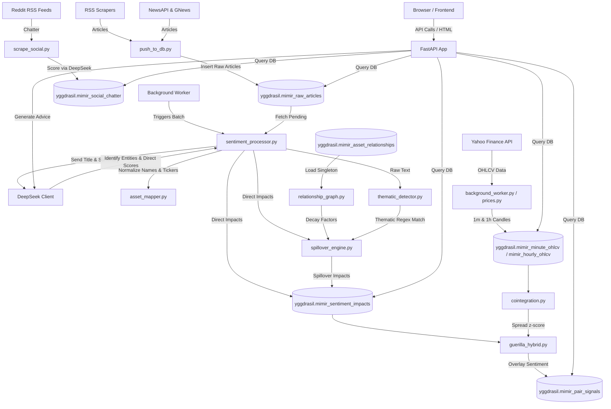

# 🌳 MIMIR: Market Intelligence & Macroeconomic Indicator Reactor

Welcome to **MIMIR** (Market Intelligence & Macroeconomic Indicator Reactor), a real-time market intelligence pipeline, macroeconomic sentiment analyzer, and statistical arbitrage engine. 

This document serves as a comprehensive developer guide and system documentation. It explains how the codebase is structured, how data flows, how the database schema works, how to use the APIs, and how future developers can seamlessly maintain, run, and expand MIMIR.

---

## 🗺️ System Architecture

The diagram below illustrates how raw news, social chatter, and market prices are ingested, processed through AI and statistical modules, cached in PostgreSQL, and served via the FastAPI web interface.



---

## 🛠️ Tech Stack

MIMIR is built on a high-performance, lightweight developer stack:

1. **Backend Server**: [FastAPI](https://fastapi.tiangolo.com/) served via [Uvicorn](https://www.uvicorn.org/) (ASGI).
2. **Database**: PostgreSQL (using the `yggdrasil` schema). Supported by [TimescaleDB](https://www.timescale.com/) for high-throughput time-series compression of 1-minute price ticks.
3. **Database Driver**: Raw SQL execution via `psycopg2` and `RealDictCursor` for high performance and minimal ORM overhead.
4. **Natural Language Processing (NLP) / LLM**: 
   - [DeepSeek API](https://api.deepseek.com/) for multi-asset sentiment scoring and semantic analysis.
5. **Data Feeds & Scraping**:
   - **Market Prices**: `yfinance` configured with `curl_cffi` to impersonate browsers and prevent rate-limiting.
   - **Breaking News**: 150+ financial/regional RSS feeds, augmented by GNews and NewsAPI.
   - **Social Sentiment**: Reddit subreddit RSS feeds (`/r/stocks`, `/r/wallstreetbets`, etc.).
6. **Frontend**: Server-rendered HTML templates utilizing [Jinja2](https://jinja.palletsprojects.com/), styled with Tailwind CSS, Vanilla CSS, and JS. Communication happens via JSON REST APIs and real-time Server-Sent Events (SSE).

---

## 🚀 Local Development Setup

To run MIMIR locally or seamlessly add more features, follow these steps:

### 1. Prerequisites
- Python 3.10+
- PostgreSQL 14+ (TimescaleDB extension recommended but optional)

### 2. Clone & Install
```bash
git clone <repository_url>
cd MIMIR-new
python -m venv .venv

# On Windows:
.venv\Scripts\activate
# On macOS/Linux:
source .venv/bin/activate

pip install -r requirements.txt
```

### 3. Environment Variables (`.env`)
Create a `.env` file in the root directory and configure the following variables:
```ini
# Database Config
DB_HOST=localhost
DB_PORT=5432
DB_NAME=pantheon_db
DB_USER=postgres
DB_PASSWORD=your_password
MIMIR_SCHEMA=yggdrasil

# API Keys
DEEPSEEK_API_KEY=your_deepseek_api_key
GROQ_API_KEY=your_groq_api_key
NVIDIA_API_KEY=your_nvidia_api_key
OPENROUTER_API_KEY=your_openrouter_api_key
NEWSAPI_KEY=your_newsapi_key
GNEWS_API_KEY=your_gnews_api_key

# Run Mode (standalone/production)
MIMIR_MODE=standalone
```

### 4. Database Seeding & Initialization
Use the provided scripts to initialize the database:
```bash
# Create the necessary schemas (run these via your SQL client or psql)
# scripts/create_timescale_tables.sql
# scripts/create_social_chatter_table.sql

# Run Python seeders
python scripts/seed_niche_assets.py
python scripts/seed_asset_relationships.py
python scripts/backfill_hourly_ohlcv.py
```

### 5. Running the Application
A `run.bat` (or equivalent shell script) is available to launch Uvicorn:
```bash
# Run server with hot-reloading enabled
uvicorn backend.app.main:app --host 0.0.0.0 --port 8000 --reload
```
Navigate to `http://localhost:8000` to access the MIMIR dashboard.

---

## 📂 Project Structure & File Guide

Below is the directory structure, which makes it easy to understand where features live:

### 📁 Backend Core (`backend/app/`)
* **`main.py`**: Application entry point. Mounts static folders, registers routers, and boots background daemon threads.
* **`database.py`**: Connection pool logic returning `RealDictCursor` or standard tuples.
* **`config.py`**: Configuration loader using `pydantic-settings`.

### 📁 Routers (`backend/app/routers/`)
* **`articles.py`**: Endpoints for paginated news filtering.
* **`prices.py`**: API for historical candles, heatmaps, and ticker searches.
* **`sentiment.py`**: Endpoints aggregating geopolitical and macro sentiment.
* **`portfolio.py`**: Handles Shadow Portfolio tracking (Buys/Sells), realized/unrealized P&L calculations, and fetches AI-driven investment strategy.
* **`niche.py`**: Powers the Guerilla Quant stat-arb signals.
* **`taxonomy.py`**: Manages dynamic text-to-ticker mappings.
* **`refresh.py`**: Server-Sent Events (SSE) stream for manual pipeline triggering.

### 📁 Data Pipelines (`backend/app/pipeline/`)
* **`background_worker.py`**: Spawns asynchronous loops running every 5 minutes (Price scraping and News scraping).
* **`sentiment_processor.py`**: Batches pending articles and dispatches them to DeepSeek.
* **`spillover_engine.py`**: Graph-based engine propagating direct sentiment scores to related asset nodes based on decay factors.

### 📁 Natural Language Processing (`backend/app/sentiment/`)
* **`deepseek_client.py`**: Formulates system prompts and parses LLM JSON outputs.
* **`asset_mapper.py`**: Normalizes and maps string entities to proper financial tickers.
* **`thematic_detector.py`**: Scans texts for macro themes (e.g., rate cuts, tariffs) to trigger thematic spillovers.

---

## 🗄️ Database Schema Details

All SQL tables reside within the `yggdrasil` schema (configurable via `.env`). Key tables include:

### 1. `mimir_raw_articles`
Stores raw news articles scraped from RSS and News APIs.
* **Columns**: `id`, `title`, `summary`, `published_ts`, `url_hash`, `title_hash`, `scoring_status`.

### 2. `mimir_sentiment_impacts`
Holds individual sentiment scores extracted by the LLM.
* **Columns**: `article_id`, `asset_name`, `sentiment_score` (-1.0 to 1.0), `direction`, `ticker`, `is_spillover`.

### 3. `mimir_portfolio` (Shadow Portfolio Ledger)
Stores user transaction details with P&L capabilities.
* **Columns**: 
  - `id (SERIAL)`
  - `ticker (VARCHAR)`
  - `order_date (TIMESTAMPTZ)`
  - `buy_price (NUMERIC)` - Represents execution price.
  - `quantity (NUMERIC)`
  - `transaction_type (VARCHAR)` - Enforces `BUY` or `SELL` constraints.

### 4. `mimir_pair_signals` & Price Tables
* `mimir_pair_signals`: Tracks quantitative statistical arbitrage opportunities (z-scores).
* `mimir_hourly_ohlcv` & `mimir_minute_ohlcv`: Stores OHLCV tick data. `mimir_minute_ohlcv` relies on TimescaleDB for automated data retention and compression.

---

## 🔌 API Usage Guide & Examples

Future developers can easily build external integrations using MIMIR's REST APIs.

### 1. Fetch Portfolio & P&L Summary
**Endpoint:** `GET /api/v1/portfolio`
**Response:**
```json
{
  "holdings": {
    "AAPL": {
      "ticker": "AAPL",
      "quantity": 15.0,
      "avg_buy_price": 145.20,
      "current_price": 175.50,
      "total_cost": 2178.00,
      "current_value": 2632.50,
      "profit_loss": 454.50,
      "profit_loss_pct": 20.86,
      "realized_pl": 120.00,
      "transactions": [...]
    }
  },
  "total_cost": 2178.0,
  "total_value": 2632.50,
  "total_profit_loss": 454.50,
  "total_realized_pl": 120.00,
  "grand_total_pl": 574.50
}
```

### 2. Log a Shadow Portfolio Transaction
**Endpoint:** `POST /api/v1/portfolio`
**Payload:**
```json
{
  "ticker": "AAPL",
  "buy_price": 150.0,
  "quantity": 10.0,
  "transaction_type": "SELL",
  "order_date": "2026-07-02T10:00:00"
}
```
*(Note: Attempting to SELL more shares than actively held will return an HTTP 400 Validation Error).*

### 3. Fetch News Articles (With Sentiment)
**Endpoint:** `GET /api/v1/articles?ticker=NVDA&limit=5`
**Response:**
```json
{
  "items": [
    {
      "id": 1024,
      "title": "Nvidia Announces New Superchip",
      "published_ts": "2026-07-02T08:00:00Z",
      "sentiment_score": 0.85,
      "impacts": [...]
    }
  ],
  "total": 42
}
```

---

## 🛠️ How to Further Develop MIMIR

MIMIR is designed to be highly modular. Here is how you can easily extend it:

### 1. Adding a New UI Web Page
1. Create your HTML template in `frontend/templates/` (e.g. `calendar.html`), extending `base.html`.
2. Add a rendering route in `backend/app/main.py`:
   ```python
   @app.get("/calendar", response_class=HTMLResponse)
   async def calendar_page(request: Request):
       return templates.TemplateResponse(request, "calendar.html")
   ```

### 2. Extending the AI Sentiment Analysis
To add new analytical dimensions (e.g., extracting "regulatory risk"):
1. Modify the system prompt located in `backend/app/sentiment/deepseek_client.py`.
2. Add the corresponding columns to the `mimir_sentiment_impacts` SQL table.
3. Update `sentiment_processor.py` to map the new JSON field into the SQL `INSERT` statement.

### 3. Adding New RSS Scraper Targets
1. Open `backend/app/scrapers/rss_scraper.py`.
2. Append your feed URL to the `FINANCIAL_RSS_FEEDS` list. The background worker will automatically pick it up on the next cycle.

### 4. Adding Macro Thematic Triggers
To implement spillovers based on global events (like an "AI Boom" or "Rate Cut"):
1. Open `backend/app/sentiment/thematic_detector.py`.
2. Add a dictionary pattern into the `THEMATIC_PATTERNS` array:
   ```python
   {
       "patterns": [r"\b(?:ai\s+infrastructure|data\s+center\s+demand)\b"],
       "theme": "ai_boom",
       "decay": 0.25,
       "direction_override": None,
       "affected": ["NVDA", "AMD", "SMCI"]
   }
   ```

---

## 💡 Troubleshooting & Notes

* **YFinance Rate Limiting (`401 Unauthorized` / Crumb Errors):** MIMIR bypasses caching issues by aggressively spoofing headers and maintaining volatile sessions using `curl_cffi` within `prices.py`. Ensure `curl_cffi` is properly installed if price fetches suddenly stop.
* **Negative Quantity Sales Rejected:** The system strictly calculates active positions. You cannot record a `SELL` transaction if it exceeds your accumulated `BUY` shares for a given ticker.
* **Sentiment Decay:** Real-time sentiment uses a time-decay factor (Half-life: 12 hours for news, 6 hours for social media) to ensure that the dashboard represents the *current* market regime rather than historical baggage.

---

**MIMIR: The tree watches.** 
For any major architectural questions, consult the underlying Python scripts inside `backend/app/pipeline/` or review the logs outputted via the background threads.