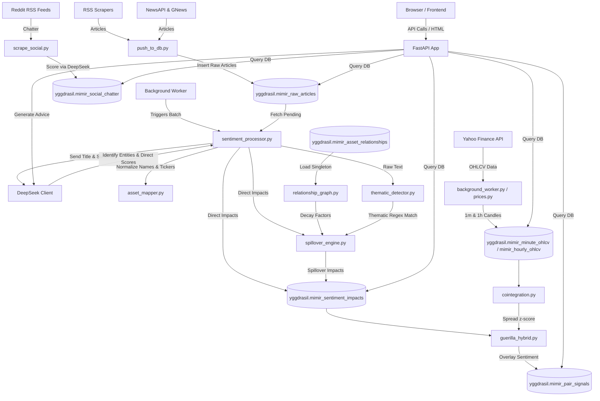

# 🌳 MIMIR: Market Intelligence & Macroeconomic Indicator Reactor

Welcome to **MIMIR** (Market Intelligence & Macroeconomic Indicator Reactor), a real-time market intelligence pipeline, macroeconomic sentiment analyzer, and statistical arbitrage engine. 

This document serves as a comprehensive developer guide and system documentation for developers, contributors, and operators. It explains how the codebase is structured, how the data flows, how the database schema works, and how to maintain, run, and expand MIMIR.

---

## 🗺️ System Architecture

The diagram below illustrates how raw news, social chatter, and market prices are ingested, processed through AI and statistical modules, cached in PostgreSQL, and served via the FastAPI web interface.



---

## 🛠️ Tech Stack

MIMIR is built on a high-performance, lightweight developer stack:

1. **Backend Server**: [FastAPI](https://fastapi.tiangolo.com/) served via [Uvicorn](https://www.uvicorn.org/) (ASGI).
2. **Database**: PostgreSQL (using the `yggdrasil` schema). Supported by [TimescaleDB](https://www.timescale.com/) for high-throughput time-series compression of 1-minute price ticks, falling back to standard tables if Timescale is not installed.
3. **Database Driver**: Raw SQL execution via `psycopg2` and `RealDictCursor` for high performance and minimal ORM overhead.
4. **Natural Language Processing (NLP) / LLM**: 
   - [DeepSeek API](https://api.deepseek.com/) (using the `deepseek-chat` or `deepseek-v4-flash` models) for multi-asset sentiment scoring and semantic analysis.
   - Local tokenizers/transformers (`torch`, `pandas`) for filtering relevance.
5. **Data Feeds & Scraping**:
   - **Market Prices**: [yfinance](https://github.com/ranarousily/yfinance) configured with custom Chrome headers and `curl_cffi` to prevent rate-limiting.
   - **Breaking News**: 150+ financial and regional RSS feeds, augmented by GNews and NewsAPI.
   - **Social Sentiment**: Reddit subreddit RSS feeds (`/r/stocks`, `/r/wallstreetbets`, `/r/macroeconomics`, etc.).
6. **Frontend**: Server-rendered HTML templates utilizing [Jinja2](https://jinja.palletsprojects.com/), customized with Vanilla CSS and JS. Communication with the backend is done via JSON REST APIs and real-time Server-Sent Events (SSE) for pipeline updates.

---

## 📂 Project Structure & File Guide

Below is the directory structure of the project, including links to key source files:

### 📁 Backend Core (`backend/app/`)
* **[main.py](file:///e:/lion_stuff/Da%20Projects/MIMIR-new/backend/app/main.py)**: The application entry point. Sets up FastAPIs, mounts static folders, registers Jinja templates, defines HTML page controllers, and boots the background worker thread.
* **[database.py](file:///e:/lion_stuff/Da%20Projects/MIMIR-new/backend/app/database.py)**: Establishes Postgres pool connections. Exports `get_db_connection()` (returns standard tuples) and `get_db_connection_dict()` (returns dict-like rows via `RealDictCursor`).
* **[config.py](file:///e:/lion_stuff/Da%20Projects/MIMIR-new/backend/app/config.py)**: System configuration loader. Reads values from `.env` utilizing `pydantic-settings`.

### 📁 Routers (`backend/app/routers/`)
* **[articles.py](file:///e:/lion_stuff/Da%20Projects/MIMIR-new/backend/app/routers/articles.py)**: Services the articles listing page. Provides paginated filtering by source, ticker, days window, sentiment tone, and geography.
* **[prices.py](file:///e:/lion_stuff/Da%20Projects/MIMIR-new/backend/app/routers/prices.py)**: Manages price ingestion. Fetches and caches candles, feeds sparkline graphs, generates the homepage performance matrix, and creates GICS sector heatmaps.
* **[sentiment.py](file:///e:/lion_stuff/Da%20Projects/MIMIR-new/backend/app/routers/sentiment.py)**: Aggregates sentiment data. Generates the macro dashboard reports, lists global geopolitical chatter, and aggregates country-specific outlooks.
* **[portfolio.py](file:///e:/lion_stuff/Da%20Projects/MIMIR-new/backend/app/routers/portfolio.py)**: Tracks user shadow portfolio holdings. Interfaces with DeepSeek to analyze holdings against macro trends and generate qualitative investment advice.
* **[niche.py](file:///e:/lion_stuff/Da%20Projects/MIMIR-new/backend/app/routers/niche.py)**: Powers the **Guerilla Quant** dashboard, supplying pair correlation signals, stat-arb historical tables, and niche metrics.
* **[taxonomy.py](file:///e:/lion_stuff/Da%20Projects/MIMIR-new/backend/app/routers/taxonomy.py)**: Exposes endpoints for managing text-to-ticker mapping configuration.
* **[refresh.py](file:///e:/lion_stuff/Da%20Projects/MIMIR-new/backend/app/routers/refresh.py)**: Serves the `/api/v1/refresh/stream` Server-Sent Events (SSE) stream. Manually triggers price syncs and runs scraping scripts while piping stdout to the browser console.

### 📁 Data Pipelines (`backend/app/pipeline/`)
* **[background_worker.py](file:///e:/lion_stuff/Da%20Projects/MIMIR-new/backend/app/pipeline/background_worker.py)**: Orchestrates background tasks. Spawns two asynchronous loops running on separate daemon threads:
  1. **Price Loop** (every 5 minutes): Refreshes 1-minute OHLCV candles for all active tickers.
  2. **News Loop** (every 5 minutes): Automates news scraping, sentiment mapping, social chatter aggregation, and niche signal scans.
* **[sentiment_processor.py](file:///e:/lion_stuff/Da%20Projects/MIMIR-new/backend/app/pipeline/sentiment_processor.py)**: Multi-threaded batch processor for pending articles. Dispatches titles/summaries to DeepSeek, normalizes output entities, inserts direct impacts, and invokes the spillover engine.
* **[spillover_engine.py](file:///e:/lion_stuff/Da%20Projects/MIMIR-new/backend/app/pipeline/spillover_engine.py)**: Graph-based sentiment propagation engine. Propagates direct impact scores (discounted by decay factors) to related asset nodes in the relationship graph.

### 📁 Quantitative Analytics (`backend/app/analytics/`)
* **[cointegration.py](file:///e:/lion_stuff/Da%20Projects/MIMIR-new/backend/app/analytics/cointegration.py)**: Computes the z-score of the spread ratio for cointegrated assets using cached daily closing prices.
* **[guerilla_hybrid.py](file:///e:/lion_stuff/Da%20Projects/MIMIR-new/backend/app/analytics/guerilla_hybrid.py)**: Overlays statistical arbitrage signals (z-scores) with real-world news sentiment to generate high-conviction trade setups.

### 📁 Natural Language Processing (`backend/app/sentiment/`)
* **[deepseek_client.py](file:///e:/lion_stuff/Da%20Projects/MIMIR-new/backend/app/sentiment/deepseek_client.py)**: Formulates system prompts, handles JSON responses, and executes relevance pre-filtering to prevent unnecessary API expenses.
* **[asset_mapper.py](file:///e:/lion_stuff/Da%20Projects/MIMIR-new/backend/app/sentiment/asset_mapper.py)**: Resolves raw entity strings to standardized asset categories, tickers, countries, and macro-regions.
* **[relationship_graph.py](file:///e:/lion_stuff/Da%20Projects/MIMIR-new/backend/app/sentiment/relationship_graph.py)**: In-memory cached singleton representing active asset relationships. Refreshed automatically by the background loop.
* **[thematic_detector.py](file:///e:/lion_stuff/Da%20Projects/MIMIR-new/backend/app/sentiment/thematic_detector.py)**: Regex-based macroeconomic theme matcher. Scans titles/summaries for event keywords (e.g. rate cuts, tariffs, war) and registers thematic spillovers.

---

## 🗄️ Database Schema & Storage Layers

All SQL tables reside within the `yggdrasil` schema. Below is a detailed view of the tables:

### 1. `mimir_raw_articles`
Stores raw news articles scraped from RSS and News APIs.
* **Primary Key**: `id (SERIAL)`
* **Columns**: `source_name (TEXT)`, `feed_url (TEXT)`, `title (TEXT)`, `link (TEXT UNIQUE)`, `published_raw (TEXT)`, `published_ts (TIMESTAMPTZ)`, `summary (TEXT)`, `url_hash (TEXT UNIQUE)`, `title_hash (VARCHAR(32) UNIQUE)`, `scraped_at (TIMESTAMPTZ)`, `scoring_status (VARCHAR(20))` (values: `'pending'`, `'scored'`, `'empty'`, `'failed'`).
* **Indexes**: Indexed on `published_ts`, `source_name`, `url_hash`, `title_hash`, and `scoring_status`.

### 2. `mimir_sentiment_impacts`
Holds individual sentiment scores extracted from news articles.
* **Primary Key**: `id (SERIAL)`
* **Columns**: `article_id (INTEGER REFERENCES mimir_raw_articles)`, `asset_name (VARCHAR)`, `asset_category (VARCHAR)`, `asset_sub_category (VARCHAR)`, `country (VARCHAR)`, `region (VARCHAR)`, `sentiment_score (NUMERIC)` (value between -1.0 and 1.0), `confidence (NUMERIC)`, `direction (VARCHAR)`, `magnitude (VARCHAR)`, `reasoning (TEXT)`, `ticker (VARCHAR)`, `policy_signal (TEXT)`, `is_spillover (BOOLEAN)`, `spillover_source_article_id (INTEGER)`, `spillover_source_asset (VARCHAR)`.
* **Unique Constraint**: `(article_id, asset_name)` to prevent duplicate impacts for a single article.
* **Indexes**: Indexed on `ticker`, `is_spillover`, and `spillover_source_article_id`.

### 3. `mimir_social_chatter`
Stores hourly aggregated sentiment from Reddit subreddits.
* **Primary Key**: `id (SERIAL)`
* **Columns**: `platform (VARCHAR)`, `channel (VARCHAR)`, `ticker (VARCHAR)`, `asset_name (VARCHAR)`, `bucket_ts (TIMESTAMPTZ)`, `sentiment_score (NUMERIC)`, `confidence (NUMERIC)`, `post_count (INTEGER)`, `engagement_score (INTEGER)`, `summary_text (TEXT)`, `scraped_at (TIMESTAMPTZ)`.
* **Unique Constraint**: `(platform, channel, ticker, bucket_ts)`.

### 4. `mimir_hourly_ohlcv` & `mimir_minute_ohlcv`
Price time-series tables used for drawing charts and calculating cointegration.
* **Columns**: `ticker (VARCHAR)`, `timestamp (TIMESTAMPTZ)`, `open (NUMERIC)`, `high (NUMERIC)`, `low (NUMERIC)`, `close (NUMERIC)`, `volume (BIGINT)`, `scraped_at (TIMESTAMPTZ)`.
* **Details**: `mimir_minute_ohlcv` is set up as a **TimescaleDB hypertable** (partitioned on `timestamp`) if Timescale is available. It enforces a compression policy for records older than 7 days, and a retention policy to purge ticks older than 14 days.

### 5. `mimir_asset_relationships`
Defines active paths for graph-based sentiment spillovers.
* **Columns**: `source_type (VARCHAR)`, `source_key (VARCHAR)`, `target_type (VARCHAR)`, `target_key (VARCHAR)`, `decay_factor (NUMERIC)` (value between 0.0 and 1.0), `is_active (BOOLEAN)`, `metadata (JSONB)`.
* **Unique Constraint**: `(source_type, source_key, target_type, target_key)`.

### 6. `mimir_portfolio`
Stores order details for the shadow portfolio.
* **Columns**: `id (SERIAL)`, `ticker (VARCHAR)`, `order_date (TIMESTAMPTZ)`, `buy_price (NUMERIC)`, `quantity (NUMERIC)`.

### 7. `mimir_pair_signals`
Tracks quantitative statistical arbitrage opportunities generated by `guerilla_hybrid.py`.
* **Columns**: `pair_id (SERIAL)`, `ticker1 (VARCHAR)`, `ticker2 (VARCHAR)`, `signal_date (TIMESTAMPTZ)`, `z_score (NUMERIC)`, `p_value (NUMERIC)`, `status (VARCHAR)`, `mean_spread (NUMERIC)`, `current_spread (NUMERIC)`, `conviction (VARCHAR)`.

---

## 🔄 Ingestion & Sentiment Decay Mechanics

### 1. Ingestion Deduplication
Articles are deduplicated using two mechanisms:
- **URL Hash (`url_hash`)**: Prevents re-scraping the same URL.
- **Title Hash (`title_hash`)**: MD5 hash of the normalized, lowercase, trimmed headline. This prevents duplicate wire-service headlines published under slightly different URLs.

### 2. Time-Decayed Sentiment Scoring
MIMIR uses a database function called `mimir_weighted_sentiment` to calculate an asset's score. It combines news and social sentiment, discounting older data using exponential time-decay models.

$$\text{Decayed Score} = \text{Sentiment Score} \times \text{Confidence} \times 2^{-\frac{\Delta t}{\tau}}$$

Where:
- $\Delta t$ is the time elapsed since publication.
- $\tau$ is the half-life. News has a half-life of 12 hours (`p_half_life_hours`), and social media has a half-life of 6 hours (`p_social_half_life_hours`).
- Social media sentiment scores are scaled down by a factor of 0.25 (`p_social_weight_multiplier`) to prevent social chatter from overshadowing news signals.

---

## 🔌 API Reference & Core Endpoints

Below are the key backend routes defined in FastAPI:

| Endpoint | Method | Router File | Description |
| :--- | :---: | :--- | :--- |
| `/api/v1/articles` | `GET` | [articles.py](file:///e:/lion_stuff/Da%20Projects/MIMIR-new/backend/app/routers/articles.py) | Fetch paginated, scored articles with sentiment indicators and search filters. |
| `/api/v1/articles/{id}` | `GET` | [articles.py](file:///e:/lion_stuff/Da%20Projects/MIMIR-new/backend/app/routers/articles.py) | Fetch details of a single article, including direct and spillover impacts. |
| `/api/v1/prices/candles` | `GET` | [prices.py](file:///e:/lion_stuff/Da%20Projects/MIMIR-new/backend/app/routers/prices.py) | Retrieve historical OHLCV data for charts (`1m` or `1h` granularity). |
| `/api/v1/prices/heatmap` | `GET` | [prices.py](file:///e:/lion_stuff/Da%20Projects/MIMIR-new/backend/app/routers/prices.py) | Return asset price performance metrics categorized by GICS sector. |
| `/api/v1/summary` | `GET` | [sentiment.py](file:///e:/lion_stuff/Da%20Projects/MIMIR-new/backend/app/routers/sentiment.py) | Aggregates bullish vs. bearish metrics for commodities, indices, and forex. |
| `/api/v1/portfolio` | `GET` | [portfolio.py](file:///e:/lion_stuff/Da%20Projects/MIMIR-new/backend/app/routers/portfolio.py) | Get shadow portfolio balance, holdings, and gains/losses. |
| `/api/v1/portfolio/advice`| `GET` | [portfolio.py](file:///e:/lion_stuff/Da%20Projects/MIMIR-new/backend/app/routers/portfolio.py) | Send portfolio holdings and macro trends to DeepSeek to generate investment strategy. |
| `/api/v1/niche/opportunities`| `GET` | [niche.py](file:///e:/lion_stuff/Da%20Projects/MIMIR-new/backend/app/routers/niche.py) | Returns active statistical arbitrage pairs with z-scores and sentiment overlays. |
| `/api/v1/taxonomy/assets` | `GET` | [taxonomy.py](file:///e:/lion_stuff/Da%20Projects/MIMIR-new/backend/app/routers/taxonomy.py) | Retrieve active static, dynamic, and unmapped historical assets. |
| `/api/v1/taxonomy/update` | `POST`| [taxonomy.py](file:///e:/lion_stuff/Da%20Projects/MIMIR-new/backend/app/routers/taxonomy.py) | Insert or update dynamic ticker mapping and update database references. |
| `/api/v1/refresh/stream` | `GET` | [refresh.py](file:///e:/lion_stuff/Da%20Projects/MIMIR-new/backend/app/routers/refresh.py) | Manual update trigger stream (SSE) that runs news/price updates and streams logs. |

---

## 💻 Web Interface Guide

MIMIR provides a responsive dark-themed dashboard:

1. **Dashboard Home (`/`)**: Displays ticker changes, LLM market summaries, regional sentiment indexes, and macro highlights (S&P 500, Dollar, Gold, VIX).
2. **Terminal Feed (`/articles`)**: A real-time terminal interface displaying scored articles. Supports filtering by source, ticker, sentiment tone, region, and search terms.
3. **Social Sentiment Feed (`/social`)**: Tracks aggregated sentiment from subreddits to monitor retail investor chatter.
4. **Asset Finance Hub (`/asset/{ticker}`)**: Visualizes 1-minute and 1-hour interactive charts, historical news sentiment, and statistical spillovers for a selected asset.
5. **Taxonomy Configurator (`/taxonomy`)**: An interface to map text-based names extracted by the LLM to Yahoo Finance tickers (e.g., mapping "Federal Reserve" -> `DX-Y.NYB`).
6. **Shadow Portfolio (`/portfolio`)**: A dashboard to log transactions, track gains/losses in real-time, and read customized strategist advice generated by the LLM.
7. **Guerilla Quant Dashboard (`/guerilla`)**: Monitors cointegration spreads and z-scores of commodity/energy pairs. Highlights buy/sell signals when z-scores exceed $\pm 2.0$.

---

## 🚀 How to Add New Features

### 1. Adding a New RSS News Source
To scrape additional headlines:
1. Open **[rss_scraper.py](file:///e:/lion_stuff/Da%20Projects/MIMIR-new/backend/app/scrapers/rss_scraper.py)**.
2. Find the `FINANCIAL_RSS_FEEDS` list.
3. Append your new XML RSS feed URL directly to the list:
   ```python
   FINANCIAL_RSS_FEEDS = [
       ...
       "https://yournewsdomain.com/rss/market-news.xml", # Your New Feed
   ]
   ```
4. The background loop will automatically ingest and parse the feed on the next run.

---

### 2. Adding a New Static Ticker Mapping
To map text entities extracted by the LLM to Yahoo Finance tickers:
1. Open **[asset_mapper.py](file:///e:/lion_stuff/Da%20Projects/MIMIR-new/backend/app/sentiment/asset_mapper.py)**.
2. Locate the `ASSET_TO_TICKER` dictionary.
3. Add a lowercase entry representing the asset name and its corresponding ticker:
   ```python
   ASSET_TO_TICKER = {
       ...
       "nvidia": "NVDA",
       "palantir technologies": "PLTR", # Your New Mapping
   }
   ```
4. (Optional) Define its country code in `COUNTRY_TO_CODE` if you want geographic classification.

---

### 3. Adding a Macro Thematic Pattern (Thematic Spillovers)
To define new regex patterns that trigger spillovers when specific topics appear in headlines:
1. Open **[thematic_detector.py](file:///e:/lion_stuff/Da%20Projects/MIMIR-new/backend/app/sentiment/thematic_detector.py)**.
2. Scroll to the `THEMATIC_PATTERNS` list.
3. Define a new dictionary with:
   - `patterns`: Regex patterns to scan.
   - `theme`: A slug identifier.
   - `decay`: Sentiment decay factor (e.g., `0.15` means the target asset receives 15% of the article's core sentiment score).
   - `direction_override`: Set to `'bullish'`, `'bearish'`, or `None` (matches article sentiment direction).
   - `affected`: A list of ticker symbols that receive the spillover.
   ```python
   THEMATIC_PATTERNS = [
       ...
       {
           "patterns": [
               r"\b(?:electric\s+vehicle|ev\s+market|solid\s+state\s+battery|lithium\s+demand)\b",
           ],
           "theme": "ev_boom",
           "decay": 0.18,
           "direction_override": None,
           "affected": ["TSLA", "LIT", "BYDDF", "ALB"],
       },
   ]
   ```

---

### 4. Creating a New API Router
To add a new API route:
1. Create a new file in `backend/app/routers/` (e.g., `backend/app/routers/calendar.py`):
   ```python
   from fastapi import APIRouter
   
   router = APIRouter()
   
   @router.get("/calendar/events")
   async def get_events():
       return {"events": []}
   ```
2. Register the router in **[main.py](file:///e:/lion_stuff/Da%20Projects/MIMIR-new/backend/app/main.py)**:
   ```python
   from .routers import calendar
   
   app.include_router(calendar.router, prefix="/api/v1", tags=["calendar"])
   ```

---

### 5. Creating a New UI Web Page
To create and render a new HTML view:
1. Add a route handler returning `templates.TemplateResponse` inside **[main.py](file:///e:/lion_stuff/Da%20Projects/MIMIR-new/backend/app/main.py)**:
   ```python
   @app.get("/calendar", response_class=HTMLResponse)
   async def calendar_page(request: Request):
       return templates.TemplateResponse(request, "calendar.html")
   ```
2. Create `calendar.html` in the **[templates](file:///e:/lion_stuff/Da%20Projects/MIMIR-new/frontend/templates)** directory. You can inherit the navbar and dashboard shell by extending `base.html`:
   ```html
   
   
   <div class="p-6">
       <h1 class="text-2xl font-bold text-[#00A6B2]">Macro Calendar</h1>
       <p class="text-[#8BA4A8]">Upcoming events list goes here.</p>
   </div>
   
   ```

---

## 💡 Developer Tips & Troubleshooting

### 🛑 yfinance Rate-Limiting & crumb errors
If yfinance starts returning `401 Unauthorized` or crumb validation errors:
* MIMIR bypasses this issue by calling `yf_cache.get_cookie_cache().dummy = True` in [background_worker.py](file:///e:/lion_stuff/Da%20Projects/MIMIR-new/backend/app/pipeline/background_worker.py) and [prices.py](file:///e:/lion_stuff/Da%20Projects/MIMIR-new/backend/app/routers/prices.py) to disable SQL disk cookie caching.
* The application uses `curl_cffi` requests sessions to impersonate Chrome browser TLS fingerprints, preventing Yahoo Finance from flagging requests as automated bot calls.

### 🔄 Resetting and Seeding the DB
Helper scripts in the `scripts/` directory can be used to set up the environment:
1. **Initialize Schemas**: Run `scripts/create_timescale_tables.sql` and `scripts/create_social_chatter_table.sql` in your PostgreSQL interface.
2. **Seed Assets**: Execute `python scripts/seed_niche_assets.py` to populate initial stat-arb assets.
3. **Establish Graph Relations**: Execute `python scripts/seed_asset_relationships.py` to seed default propagation decay paths.
4. **Historical Price Import**: Run `python scripts/backfill_hourly_ohlcv.py` to fetch historical hourly candles for the portfolio charts.

---

**MIMIR: The tree watches.** For any questions, please consult the database schema or review the background logger outputs.