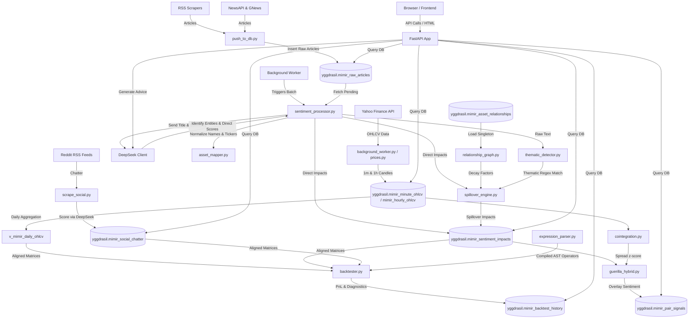

# 🌳 MIMIR: Market Intelligence & Macroeconomic Indicator Reactor

Welcome to **MIMIR** (Market Intelligence & Macroeconomic Indicator Reactor), a real-time market intelligence pipeline, macroeconomic sentiment analyzer, statistical arbitrage engine, and **quantitative strategy backtester**.

This repository is designed to be easily navigated and understood by both **human developers** and **web-based LLM assistants** (e.g., ChatGPT, Claude, Gemini) to enable rapid project context bootstrapping and seamless pair programming.

---

## 🎯 Core Mission & Trading Edge

MIMIR operates on **Project Odin: Retail-Predator System Architecture**. Instead of chasing breaking news articles 15-33 minutes late against HFT algos, MIMIR exploits systematic, predictable retail behavioral patterns across multi-tiered supply chains.

Key structural trading edges:
1. **Sentiment Regime Classification**: Classifying *WHERE* in the narrative cycle an asset is (`ACCUMULATING`, `PANIC_OVERSOLD`, `EXHAUSTED`, `ALIGNED`, `DIVERGENT`, `NEUTRAL`) using 3-day sentiment velocity, acceleration, price-sentiment gap, and narrative persistence.
2. **Supply Chain Cascade ("Trade the Ripple, Not the Splash")**: Identifying *WHAT* to trade (2nd & 3rd order beneficiaries with 2–10 day diffusion delays) while skipping headline frontline tickers (e.g., NVDA, TSLA) where market efficiency is instantaneous.
3. **Retail Behavioral Exploitation**: Explicitly exploiting retail flaws (hype chasing, panic selling on stable fundamentals, Monday morning opening emotion, 3-5 day attention span decay, and price/volume ignoring).
4. **Session & Execution Discipline**: Enforcing strict US regular market session execution (Mon-Fri 09:30–16:00 ET), market open/close blackout windows, and Monday morning strategy delays (10:30 AM ET).
5. **Self-Learning Relationship Validation**: Weekly automated feedback loop evaluating supply chain pair hit-rates, promoting validated relationships (`hit_rate >= 0.55`), and deprecating failing links.

---

## 🗺️ System Architecture & Data Flow

Below is the diagram illustrating the end-to-end data flow:


```mermaid
graph TD
    %% Ingestion
    RSS[RSS Scrapers] -->|Articles| P2DB[push_to_db.py]
    NAPI[NewsAPI & GNews] -->|Articles| P2DB
    P2DB -->|Insert Raw Articles| RAW_DB[(yggdrasil.mimir_raw_articles)]

    %% Sentiment Ingestion (Social)
    REDDIT[Reddit RSS Feeds] -->|Chatter| SOC_SCR[scrape_social.py]
    SOC_SCR -->|Score via DeepSeek| SOC_DB[(yggdrasil.mimir_social_chatter)]

    %% Sentiment Pipeline
    BG[Background Worker] -->|Triggers Batch| SP[sentiment_processor.py]
    RAW_DB -->|Fetch Pending| SP
    SP -->|Send Title & Summary| LLM[DeepSeek Client]
    LLM -->|Identify Entities & Direct Scores| SP
    SP -->|Normalize Names & Tickers| AM[asset_mapper.py]
    SP -->|Direct Impacts| IMP_DB[(yggdrasil.mimir_sentiment_impacts)]

    %% Spillover Engine
    SP -->|Direct Impacts| SE[spillover_engine.py]
    RG[relationship_graph.py] -->|Decay Factors| SE
    DB_RG[(yggdrasil.mimir_asset_relationships)] -->|Load Singleton| RG
    SP -->|Raw Text| TD[thematic_detector.py]
    TD -->|Thematic Regex Match| SE
    SE -->|Spillover Impacts| IMP_DB

    %% Prices & Analytics
    YF[Yahoo Finance API] -->|OHLCV Data| P_FETCH[background_worker.py / prices.py]
    P_FETCH -->|1m & 1h Candles| PRICE_DB[(yggdrasil.mimir_minute_ohlcv / mimir_hourly_ohlcv)]
    
    %% Daily Aggregator View
    PRICE_DB -->|Daily Aggregation| D_VIEW[v_mimir_daily_ohlcv]
    
    %% Vectorized Quant Backtester Engine
    D_VIEW & IMP_DB & SOC_DB -->|Aligned Matrices| B_ENG[backtester.py]
    PARS[expression_parser.py] -->|Compiled AST Operators| B_ENG
    B_ENG -->|PnL & Diagnostics| HIST_DB[(yggdrasil.mimir_backtest_history)]

    %% Stat Arbitrage (Guerilla Quant)
    PRICE_DB --> COINT[cointegration.py]
    IMP_DB --> HYB[guerilla_hybrid.py]
    COINT -->|Spread z-score| HYB
    HYB -->|Overlay Sentiment| SIG_DB[(yggdrasil.mimir_pair_signals)]

    %% Frontend API
    API[FastAPI App] -->|Query DB| RAW_DB & IMP_DB & PRICE_DB & SIG_DB & SOC_DB & HIST_DB
    API -->|Generate Advice| LLM
    Web[Browser / Frontend] -->|API Calls / HTML| API
```

---

## 📂 Codebase Directory & File Reference

Use this directory map to understand exactly where features live and what each script does.

### 📁 Backend Core (`backend/app/`)

* [main.py](file:///backend/app/main.py)
  * **Role**: FastAPI application entry point.
  * **Key Functions**: Mounts static directories, configures template rendering engines, registers all system routers, and initializes background thread pipelines (such as price fetching and news scanning daemon runs).
* [config.py](file:///backend/app/config.py)
  * **Role**: Application settings and configuration manager.
  * **Key Functions**: Loads configuration properties from `.env` or system environment variables using `pydantic-settings` to enforce validation.
* [database.py](file:///backend/app/database.py)
  * **Role**: PostgreSQL database connection pooler.
  * **Key Functions**: Exposes database connection resources, context managers, and raw cursor execution loops (optimized via `psycopg2.extras.RealDictCursor`).

---

### 📁 Quantitative & Statistical Analytics (`backend/app/analytics/`)

* [backtester.py](file:///backend/app/analytics/backtester.py)
  * **Role**: Vectorized strategy simulation engine.
  * **Key Functions**: Loads aligned price and sentiment matrices, executes strategy weights, simulates timezone-aligned market executions, deducts trading slippage fees, enforces survivorship masks, and calculates key statistics (Sharpe Ratio, Win Rate, Turnover, Drawdowns, Information Coefficient, and Fitness).
* [expression_parser.py](file:///backend/app/analytics/expression_parser.py)
  * **Role**: Secure AST (Abstract Syntax Tree) formula compiler.
  * **Key Functions**: Parses mathematical strings into Pandas-vectorized operations. Supports cross-sectional rankings, rolling regressions, logical conditionals (`if_else`), decay calculations, and custom math functions.
* [cointegration.py](file:///backend/app/analytics/cointegration.py)
  * **Role**: Statistical Cointegration modeler.
  * **Key Functions**: Evaluates price pairs, calculates Engle-Granger two-step cointegration, computes rolling hedge ratios, and evaluates spread z-scores.
* [guerilla_hybrid.py](file:///backend/app/analytics/guerilla_hybrid.py)
  * **Role**: Cointegration spread and sentiment overlay synthesizer.
  * **Key Functions**: Combines statistical spread z-scores with LLM sentiment data to dynamically score and filter trade setups.
* [performance_evaluator.py](file:///backend/app/analytics/performance_evaluator.py)
  * **Role**: Metric calculation utility.
  * **Key Functions**: Computes Sharpe ratios, annualized returns, max drawdowns, information coefficients, and general validation checks.
* [signal_fusion.py](file:///backend/app/analytics/signal_fusion.py)
  * **Role**: Multi-factor signal combiner.
  * **Key Functions**: Normalizes and fuses technical indicator metrics, corporate fundamentals, and news sentiment scores into unified conviction scales.
* [technical_analysis.py](file:///backend/app/analytics/technical_analysis.py)
  * **Role**: Vectorized technical indicator computer.
  * **Key Functions**: Calculates RSI, moving averages (EMA/SMA), Bollinger Bands, and support/resistance zones using Pandas.
* [casino_recommender.py](file:///backend/app/analytics/casino_recommender.py)
  * **Role**: Options strategy recommendation engine.
  * **Key Functions**: Evaluates market sentiment, volatility metrics, and stock technicals to generate quantitative options strategy recommendations (vertical spreads, iron condors, straddles).
* [options_pricing.py](file:///backend/app/analytics/options_pricing.py) & [options_data.py](file:///backend/app/analytics/options_data.py)
  * **Role**: Options pricing & chain analytics.
  * **Key Functions**: Computes Black-Scholes options pricing, Greeks (Delta, Gamma, Theta, Vega), IV ranks, and fetches options chains.
* [strategy_builder.py](file:///backend/app/analytics/strategy_builder.py)
  * **Role**: Multi-leg options strategy calculator.
  * **Key Functions**: Computes multi-leg option payoff surfaces, probability of profit, aggregate Greeks, and Kelly Criterion position sizing.
* [sentiment_momentum.py](file:///backend/app/analytics/sentiment_momentum.py)
  * **Role**: Sentiment regime detection & retail behavioral momentum engine.
  * **Key Functions**: Computes 3-day sentiment velocity, acceleration, price-sentiment gap, narrative persistence, unanimity score, attention decay ratio, panic score, earnings trap score, and pro vs retail divergence. Classifies tickers into actionable regime states (`ACCUMULATING`, `PANIC_OVERSOLD`, `EXHAUSTED`, `ALIGNED`, `DIVERGENT`, `NEUTRAL`).
* [chain_validator.py](file:///backend/app/analytics/chain_validator.py)
  * **Role**: Weekly supply chain relationship self-learning validator.
  * **Key Functions**: Evaluates empirical price diffusion hit-rates for discovered asset relationships, promoting validated targets (`hit_rate >= 0.55`) and deprecating failing links (`hit_rate < 0.40`).
* [paper_trader.py](file:///backend/app/analytics/paper_trader.py)
  * **Role**: Automated paper trading execution engine.
  * **Key Functions**: Tracks paper positions, auto-executes signal alerts outside blackout windows, enforces strict US regular session hours (Mon-Fri 09:30–16:00 ET), auto-tightens stop-losses on herd arrival, and manages staged position sizing.
* [financial_skills.py](file:///backend/app/analytics/financial_skills.py)
  * **Role**: AI assistant skill engine.
  * **Key Functions**: Executes specialized quantitative functions and market research tools invoked by the AI Oracle research assistant.

---

### 📁 Data Pipelines (`backend/app/pipeline/`)

* [background_worker.py](file:///backend/app/pipeline/background_worker.py)
  * **Role**: Asynchronous task orchestrator.
  * **Key Functions**: Manages background loop triggers (such as polling pricing feeds and scraping financial sites every 5 minutes).
* [sentiment_processor.py](file:///backend/app/pipeline/sentiment_processor.py)
  * **Role**: Batch news sentiment scoring pipeline.
  * **Key Functions**: Extracts unscored news items from the database, dispatches text to LLM endpoints, runs asset mapping, and inserts sentiment scores back to the database.
* [spillover_engine.py](file:///backend/app/pipeline/spillover_engine.py)
  * **Role**: Sentiment spillover propagator.
  * **Key Functions**: Propagates sentiment scores from direct asset occurrences to related companies using decay factors and theme rules defined in the network graph.

---

### 📁 Sentiment & NLP Engine (`backend/app/sentiment/`)

* [asset_mapper.py](file:///backend/app/sentiment/asset_mapper.py)
  * **Role**: Text entity entity-to-ticker resolver.
  * **Key Functions**: Maps company names, alternative names, and raw strings to standardized financial market tickers.
* [deepseek_client.py](file:///backend/app/sentiment/deepseek_client.py)
  * **Role**: Structured LLM communication interface.
  * **Key Functions**: Formulates structured system prompts and parses JSON outputs from DeepSeek APIs.
* [llm_client.py](file:///backend/app/sentiment/llm_client.py)
  * **Role**: LLM routing layer.
  * **Key Functions**: Handles fallbacks, retries, and API configuration mappings across providers (DeepSeek, Groq, OpenRouter, NVIDIA).
* [agent_tools.py](file:///backend/app/sentiment/agent_tools.py)
  * **Role**: AI Research Oracle tool definitions.
  * **Key Functions**: Exposes DB queries, news searching, chart generation, and financial analysis tools to the interactive research agent.
* [relationship_graph.py](file:///backend/app/sentiment/relationship_graph.py)
  * **Role**: Asset dependency network mapping tool.
  * **Key Functions**: Builds and queries direct relationships (supply chain partners, competitors, parent-subsidiary) and tier-specific query helper methods (`get_tier2_targets`, `get_tier3_targets`, `get_skip_list`) to feed the spillover engine.
* [supply_chain_mapper.py](file:///backend/app/sentiment/supply_chain_mapper.py)
  * **Role**: 3-method supply chain relationship auto-discovery engine.
  * **Key Functions**: Discovers 2nd and 3rd-tier supply chain beneficiary relationships via Co-occurrence mining, DeepSeek LLM dynamic discovery for high-impact headlines (`|score| >= 0.7`), and curated seed chains (Data Centers, EVs, Defense).
* [thematic_detector.py](file:///backend/app/sentiment/thematic_detector.py)
  * **Role**: Macroeconomic indicator scanner.
  * **Key Functions**: Scans texts for macro themes and generates spillover impacts for tiered supply chain targets (`affected_tier2` and `affected_tier3`) while skipping Tier 1 frontline tickers.

---

### 📁 Ingestion Scrapers (`backend/app/scrapers/`)

* [rss_scraper.py](file:///backend/app/scrapers/rss_scraper.py)
  * **Role**: General news ingestion parser.
  * **Key Functions**: Downloads and parses articles from major financial publications' RSS feeds.
* [newsapi_scraper.py](file:///backend/app/scrapers/newsapi_scraper.py)
  * **Role**: Direct NewsAPI client.
  * **Key Functions**: Fetches target breaking articles using NewsAPI query definitions.
* [niche_sources.py](file:///backend/app/scrapers/niche_sources.py)
  * **Role**: Niche and custom RSS source definitions parser.
  * **Key Functions**: Integrates specialized feeds (e.g. localized commodities, specialized technology sectors).

---

### 📁 FastAPI Routing Controllers (`backend/app/routers/`)

* [backtest.py](file:///backend/app/routers/backtest.py)
  * **Role**: Quantitative simulation endpoint handler.
  * **Key Functions**: Runs quantitative formula simulations (`POST /run`) and retrieves history log tables (`GET /history`).
* [portfolio.py](file:///backend/app/routers/portfolio.py)
  * **Role**: Shadow portfolio ledger tracker.
  * **Key Functions**: Manages transactions (buy/sell orders), retrieves portfolio valuations, calculates realized/unrealized P&L, sanitizes HTML advice, and fetches AI-driven investment recommendations.
* [prices.py](file:///backend/app/routers/prices.py)
  * **Role**: Price feed endpoint controller.
  * **Key Functions**: Resolves candle charts, asset lists, heatmaps, and queries ticker prices.
* [sentiment.py](file:///backend/app/routers/sentiment.py)
  * **Role**: Sentiment tracking dashboard API.
  * **Key Functions**: Exposes sentiment metrics, aggregates score curves, and returns article analysis reports.
* [articles.py](file:///backend/app/routers/articles.py)
  * **Role**: Scraped news feeds pagination controller.
  * **Key Functions**: Provides paginated list views of news records with search and filtration filters.
* [casino.py](file:///backend/app/routers/casino.py)
  * **Role**: Casino Quant Options router.
  * **Key Functions**: Handles options chain analytics, strategy calculations, Greeks surfaces, and automated AI strategy recommendations.
* [paper_trading.py](file:///backend/app/routers/paper_trading.py)
  * **Role**: Automated paper trading execution router.
  * **Key Functions**: Configures auto-trading policies, position sizing, auto-exit rules, and processes paper position management.
* [research.py](file:///backend/app/routers/research.py)
  * **Role**: Interactive AI Oracle market research router.
  * **Key Functions**: Manages chat sessions, messages, tool execution, and document export (DOCX/Markdown).
* [niche.py](file:///backend/app/routers/niche.py)
  * **Role**: Cointegration and Guerilla Quant views router.
  * **Key Functions**: Retrieves pair relationships, historical spreads, and real-time trade signals.
* [taxonomy.py](file:///backend/app/routers/taxonomy.py)
  * **Role**: Entity mapping config helper.
  * **Key Functions**: Supports CRUD adjustments for name-to-ticker mapping.
* [trade_alerts.py](file:///backend/app/routers/trade_alerts.py)
  * **Role**: Trade alert signal generator.
  * **Key Functions**: Monitors technical triggers (e.g. RSI extremes or MACD crossovers) and posts alerts.
* [refresh.py](file:///backend/app/routers/refresh.py)
  * **Role**: Real-time event broker (SSE).
  * **Key Functions**: Streams real-time pipeline status updates and progress tracking to the front-end dashboard.
* [voice.py](file:///backend/app/routers/voice.py)
  * **Role**: Mimir Voice Router (Interactive Voice Briefings).
  * **Key Functions**: Generates Jarvis-style voice recaps of overnight market moves and portfolio impacts, voiced in Mimir's authentic Scottish persona.

---

### 📁 Core Services (`backend/app/services/`)

* [voice_service.py](file:///backend/app/services/voice_service.py)
  * **Role**: Voice Synthesis and TTS integration.
  * **Key Functions**: Handles zero-shot voice cloning using `F5-TTS` (CUDA GPU) to generate Mimir's custom voice, with sub-second fallbacks to `edge-tts`.

---

### 📁 Scripts Directory (`scripts/`)

* [run_full_pipeline.py](file:///scripts/run_full_pipeline.py)
  * **Role**: Master CLI pipeline executor.
  * **Key Functions**: Initiates a synchronous run of the entire pipeline: scrapes news, runs sentiment analysis, applies spillovers, and updates database records.
* [run_price_fetch.py](file:///scripts/run_price_fetch.py)
  * **Role**: Independent price downloader script.
  * **Key Functions**: Pulls historical price feeds from Yahoo Finance and updates Postgres tables.
* [scrape_social.py](file:///scripts/scrape_social.py)
  * **Role**: Social sentiment crawler.
  * **Key Functions**: Scrapes designated Subreddits via RSS feeds using `curl_cffi` to avoid rate limits, scores raw text using DeepSeek, and writes outputs to social tables.
* [scrape_twitter.py](file:///scripts/scrape_twitter.py)
  * **Role**: Dedicated Twitter scraper mockup/client.
  * **Key Functions**: Processes raw Twitter feeds to extract sentiment insights.
* [push_to_db.py](file:///scripts/push_to_db.py)
  * **Role**: Article database importer utility.
  * **Key Functions**: Ingests raw parsed articles and hashes content to avoid duplicate inserts.
* [fetch_fundamentals.py](file:///scripts/fetch_fundamentals.py)
  * **Role**: Fundamental data extractor.
  * **Key Functions**: Downloads balance sheets and income statement metrics for the active asset universe.
* [tune_ticker_parameters.py](file:///scripts/tune_ticker_parameters.py)
  * **Role**: Trading strategy parameters optimizer.
  * **Key Functions**: Tunes asset indicators (e.g. RSI lookback periods or Z-score limits) using historical performance feedback.
* [seed_supply_chains.py](file:///scripts/seed_supply_chains.py)
  * **Role**: Project Odin supply chain relationship seeder.
  * **Key Functions**: Populates initial curated supply chain beneficiary maps and executes co-occurrence relationship mining.
* [migrate_db_supply_chains.py](file:///scripts/migrate_db_supply_chains.py)
  * **Role**: Database schema migration script.
  * **Key Functions**: Extends `mimir_asset_relationships` and `mimir_sentiment_impacts` tables with `chain_tier`, `diffusion_days`, `chain_category`, `is_validated`, and `activation_date` columns.
* [reset_paper_trader.py](file:///scripts/reset_paper_trader.py)
  * **Role**: Paper trading account reset script.
  * **Key Functions**: Clears portfolio positions and trade logs, resetting starting paper capital to $200.00.
* [mt5_price_fetcher.py](file:///scripts/mt5_price_fetcher.py)
  * **Role**: MT5 real-time 1-minute price ingestion service.
  * **Key Functions**: Fetches live price data via MetaTrader 5 API for real-time asset feeds.
* [test_ml_signals.py](file:///scripts/test_ml_signals.py)
  * **Role**: Machine Learning signal generator tests.
  * **Key Functions**: Validates XGBoost signal models and data extraction logic.

---

### 📁 Frontend Templates (`frontend/templates/`)

* [base.html](file:///frontend/templates/base.html): Base shell providing unified navigation and global JS event listeners.
* [index.html](file:///frontend/templates/index.html): Main dashboard displaying high-level sentiment feeds and macro graphs.
* [articles.html](file:///frontend/templates/articles.html): Article explorer for viewing raw articles and direct sentiment impacts.
* [social.html](file:///frontend/templates/social.html): Social dashboard displaying Reddit and forum indicators.
* [finance.html](file:///frontend/templates/finance.html): Detail page for specific assets showing prices, signals, and news history.
* [portfolio.html](file:///frontend/templates/portfolio.html): Shadow portfolio ledger interface displaying returns, P&L graphs, sanitized AI advice, and paper trading execution.
* [backtest.html](file:///frontend/templates/backtest.html): Interactive quant formula testing simulator.
* [alphas.html](file:///frontend/templates/alphas.html): Alpha formula catalog containing pre-built strategies.
* [guerilla.html](file:///frontend/templates/guerilla.html): Cointegration spread monitoring and signal dashboard.
* [casino.html](file:///frontend/templates/casino.html): Options strategy laboratory, payoff surface visualizer, and options recommendation scanner.
* [research_chat.html](file:///frontend/templates/research_chat.html): Interactive AI Market Oracle research assistant chat with tool execution and DOCX/Markdown document export.
* [watchlist.html](file:///frontend/templates/watchlist.html): Custom asset watchlist tracker view.
* [map.html](file:///frontend/templates/map.html): Relationship network graph visualizer.
* [taxonomy.html](file:///frontend/templates/taxonomy.html): Name-to-ticker mapping manager.
* [alerts.html](file:///frontend/templates/alerts.html): Technical signal alert log.

### 📁 Frontend Scripts (`frontend/static/js/`)
* [mimir_jarvis.js](file:///frontend/static/js/mimir_jarvis.js): Web Speech API integration for hands-free voice commands, live transcriptions, and audio playback of market briefings.

---

### 🗄️ Database Schema Reference

All tables reside within the `yggdrasil` schema of PostgreSQL:

1. **`mimir_raw_articles`**: Raw articles scraped from news RSS feeds.
   * `id` (SERIAL PRIMARY KEY)
   * `title` (TEXT), `summary` (TEXT), `url` (TEXT)
   * `published_ts` (TIMESTAMPTZ)
   * `url_hash` (VARCHAR), `title_hash` (VARCHAR)
   * `scoring_status` (VARCHAR - default 'pending')
2. **`mimir_sentiment_impacts`**: Output sentiment scores calculated by the LLM.
   * `id` (SERIAL PRIMARY KEY)
   * `article_id` (INTEGER REFERENCES mimir_raw_articles)
   * `asset_name` (VARCHAR), `ticker` (VARCHAR)
   * `sentiment_score` (NUMERIC from -1.0 to 1.0)
   * `direction` (VARCHAR - 'positive', 'neutral', 'negative')
   * `is_spillover` (BOOLEAN - indicates if propagated via spillover engine)
3. **`mimir_social_chatter`**: Social forum chatter records.
   * `id` (SERIAL PRIMARY KEY)
   * `source` (VARCHAR - e.g., 'reddit')
   * `title` (TEXT), `body` (TEXT), `author` (VARCHAR)
   * `sentiment_score` (NUMERIC), `ticker` (VARCHAR)
   * `url` (TEXT), `created_at` (TIMESTAMPTZ)
4. **`mimir_minute_ohlcv` & `mimir_hourly_ohlcv`**: High-frequency asset price ticks.
   * `timestamp` (TIMESTAMPTZ PRIMARY KEY)
   * `ticker` (VARCHAR PRIMARY KEY)
   * `open`, `high`, `low`, `close` (NUMERIC)
   * `volume` (NUMERIC)
5. **`mimir_portfolio`**: Active ledger recording user asset holdings.
   * `id` (SERIAL PRIMARY KEY)
   * `ticker` (VARCHAR)
   * `order_date` (TIMESTAMPTZ)
   * `buy_price` (NUMERIC)
   * `quantity` (NUMERIC)
   * `transaction_type` (VARCHAR - 'BUY' or 'SELL')
   * `fee` (NUMERIC)
6. **`mimir_backtest_history`**: Quant strategy simulation results.
   * `id` (SERIAL PRIMARY KEY)
   * `formula` (TEXT), `universe` (VARCHAR), `style` (VARCHAR)
   * `start_date` (DATE), `end_date` (DATE)
   * `holding_period` (INTEGER), `slippage_bps` (NUMERIC)
   * `sharpe`, `annualized_return`, `max_drawdown`, `turnover`, `fitness`, `win_rate`, `ic` (NUMERIC)
7. **`mimir_chat_sessions` & `mimir_chat_messages`**: Interactive AI Market Oracle chat session persistent state and tool execution logs.
8. **`mimir_paper_trading_config` & `mimir_paper_portfolio` & `mimir_paper_trade_log`**: Automated paper trading configuration, open positions, and execution trade logs.

---

## ⚡ Tech Stack & Architecture

* **Backend**: FastAPI (Python 3.10+) served via Uvicorn with asynchronous event loops.
* **Database**: PostgreSQL (using TimescaleDB hypertable extensions for compressed time-series candle & orderbook data) via `psycopg2` connection pooling.
* **Machine Learning & Predictive Signals**:
  * **XGBoost**: Gradient boosted decision trees for real-time signal generation and predictive trade alert scoring (`scripts/test_ml_signals.py`).
  * **WorldQuant AST Parser**: Custom Abstract Syntax Tree vectorizer (`backend/app/analytics/expression_parser.py`) supporting cross-sectional operators, rolling math, and decay functions.
* **LLM Engine & NLP**: DeepSeek, OpenRouter, Groq, NVIDIA API integration for entity sentiment extraction, automated portfolio advice, and interactive AI market chat research (`backend/app/routers/research.py`).
* **Voice & TTS Integration**: F5-TTS (zero-shot voice cloning on CUDA GPU) and edge-tts for sub-second neural voice synthesis. Web Speech API for hands-free voice commands.
* **Live Ingestion & Execution**:
  * **MetaTrader 5 (MT5)**: Real-time tick and 1-minute OHLCV price streamer (`scripts/mt5_price_fetcher.py`).
  * **Yahoo Finance & News Scraping**: Resilient `curl_cffi` client sessions to spoof browser parameters and bypass rate limits.
* **Frontend**: Responsive UI built with Vanilla HTML5, Vanilla CSS / Tailwind CSS design system, Chart.js visualizations, and real-time Server-Sent Events (SSE) status streams.

---

## ✨ Key Features & Capabilities

1. **Real-Time Market & MT5 Price Ingestion**: Dedicated MT5 client engine streaming 1-minute live price candles into TimescaleDB tables alongside Yahoo Finance fallback pollers.
2. **LLM News & Social Sentiment Pipeline**: Automated ingestion of RSS news and Reddit subreddits via `scrape_social.py`, entity mapping with `asset_mapper.py`, and graph network spillover calculations using `spillover_engine.py`.
3. **Machine Learning Signal Fusion**: XGBoost ML predictive signal pipelines combining technical analysis (RSI, EMA, Bollinger Bands), sentiment dynamics, and fundamental metrics into conviction scores.
4. **Vectorized Quant Strategy Backtester**: Full WorldQuant-style expression parser engine calculating Sharpe ratios, win rates, drawdown stats, and Information Coefficient (IC) metrics over aligned pricing and sentiment matrices.
5. **Interactive AI Market Research & Chat Assistant**: Multi-session persistent chat interface backed by PostgreSQL `mimir_chat_sessions` and `mimir_chat_messages` tables for deep asset analysis.
6. **Shadow Portfolio Ledger & Dividend Tracker**: Transaction tracking for Buy, Sell, and Dividend executions with real-time unrealized/realized P&L metrics and automated AI portfolio optimization advice.
7. **Cointegration & Guerilla Quant Engine**: Automated spread z-score cointegration modeling (`cointegration.py`) for statistical arbitrage pair trading overlayed with LLM sentiment signals.
8. **Interactive Jarvis-Style Voice Briefings**: Hands-free voice command interface (`mimir_jarvis.js`) generating LLM-powered market recaps and portfolio digests, synthesized using F5-TTS voice cloning and edge-tts for authentic Scottish brogue persona delivery.

---

## 🚀 Getting Started

### 1. Installation & Environment Config
```bash
git clone <repository_url>
cd MIMIR-new
python -m venv .venv
source .venv/bin/activate  # On Windows: .venv\Scripts\activate
pip install -r requirements.txt
```

Create a `.env` file in the root workspace directory:
```ini
DB_HOST=localhost
DB_PORT=5432
DB_NAME=pantheon_db
DB_USER=postgres
DB_PASSWORD=your_password
MIMIR_SCHEMA=yggdrasil

DEEPSEEK_API_KEY=your_deepseek_key
OPENROUTER_API_KEY=your_openrouter_key
NEWSAPI_KEY=your_newsapi_key
GNEWS_API_KEY=your_gnews_key
MIMIR_MODE=standalone
```

### 2. Seeding & Running
```bash
# Seed initial asset lists, price candles, and relationships
python scripts/seed_niche_assets.py
python scripts/seed_asset_relationships.py
python scripts/backfill_hourly_ohlcv.py

# Launch FastAPI web app locally (Hot reload enabled)
uvicorn backend.app.main:app --host 0.0.0.0 --port 8000 --reload
```
Open `http://localhost:8000` to view the interactive dashboard on your laptop.

### 📱 Accessing from iPad / Mobile (Same Wi-Fi)
1. Run `run.bat` on your laptop. The terminal will display your laptop's local network IP (e.g. `http://192.168.1.109:8000`).
2. Make sure your iPad is connected to the same Wi-Fi network.
3. Open Safari or Chrome on your iPad and enter `http://<LAPTOP_IP>:8000` (e.g., `http://192.168.1.109:8000`).

---

## 🛠️ How to Extend MIMIR (Guide for LLMs & Developers)

### 1. Adding a New Math Operator
To introduce a new WorldQuant formula operator (e.g. `ts_std`):
1. Open [expression_parser.py](file:///backend/app/analytics/expression_parser.py).
2. Register the operator token name under `_eval_function()`.
3. Implement the vectorized calculation using Pandas rolling helpers:
   ```python
   elif func_name == "ts_std":
       arg = self._evaluate_node(node.args[0])
       window = int(self._evaluate_node(node.args[1]))
       return arg.rolling(window, min_periods=1).std()
   ```
4. Add the documentation cheat sheet in [backtest.html](file:///frontend/templates/backtest.html).

### 2. Adding a New Data Feed Variable
To introduce new metrics to the backtester (e.g., *dividend yields*):
1. Load the data table in `BacktestEngine.load_data()` inside [backtester.py](file:///backend/app/analytics/backtester.py).
2. Pivot the table so that rows match timestamps and columns match tickers.
3. Save the matrix into the data registry dictionary:
   ```python
   self.dfs['dividend_yield'] = pivoted_div_df
   ```
4. The formula parser will automatically allow utilizing `dividend_yield` inside trading formulas.