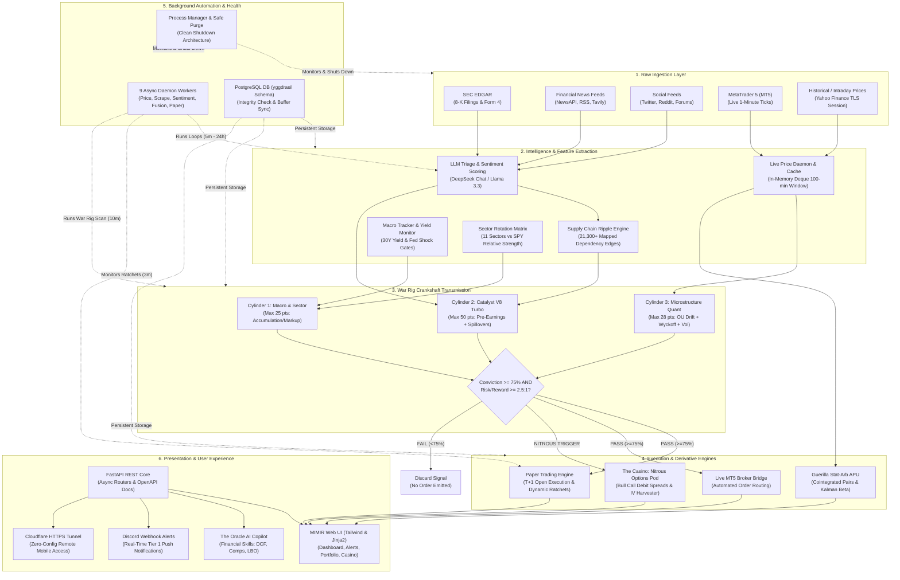
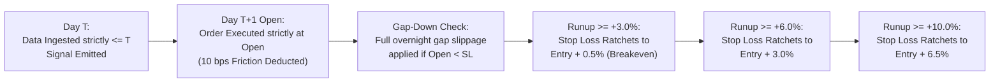

# 🌳 MIMIR: Market Intelligence & Macroeconomic Indicator Reactor

[](https://www.python.org/)
[](https://fastapi.tiangolo.com)
[](https://www.postgresql.org/)
[](https://www.deepseek.com/)
[](https://www.metatrader5.com/)
[]()

> **MIMIR** (Market Intelligence & Macroeconomic Indicator Reactor) is an institutional-grade, real-time quantitative trading reactor, macroeconomic sentiment analyzer, statistical arbitrage engine, and automated execution platform. Built with a unified **Single-Shaft War Rig Architecture**, MIMIR converges unstructured news catalysts, macroeconomic rate regimes, multi-tier supply chain graphs, and microstructure statistics into high-conviction asymmetric trade decisions.

---

## 📑 Table of Contents

1. [Executive Summary & Core Mission](#-executive-summary--core-mission)
2. [End-to-End System Architecture](#-end-to-end-system-architecture)
3. [Core Quantitative Philosophies](#-core-quantitative-philosophies)
   - [The Mad Max War Rig Transmission Architecture](#-the-mad-max-war-rig-transmission-architecture)
   - [The 3 Cylinders of the Crankshaft](#-the-3-cylinders-of-the-crankshaft)
   - [The Casino: Modular Nitrous Oxide Options Pod](#-the-casino-modular-nitrous-oxide-options-pod)
   - [Guerilla Stat-Arb Auxiliary Power Unit (APU)](#-guerilla-stat-arb-auxiliary-power-unit-apu)
   - [Agentic Financial Skills Engine (The Oracle)](#-agentic-financial-skills-engine-the-oracle)
4. [Rigorous Institutional Risk & Bias Controls](#-rigorous-institutional-risk--bias-controls)
5. [Performance Benchmark Matrix](#-performance-benchmark-matrix-june--september-2026)
6. [Comprehensive User Guide: How to Use MIMIR](#-comprehensive-user-guide-how-to-use-mimir)
   - [1. Command Center & Daily Situation Reports](#1-command-center--daily-situation-reports-)
   - [2. War Rig Trade Alerts & Signal Conviction](#2-war-rig-trade-alerts--signal-conviction-alerts)
   - [3. Portfolio & Automated Paper Trading](#3-portfolio--automated-paper-trading-portfolio)
   - [4. The Casino: Deploying Asymmetric Options](#4-the-casino-deploying-asymmetric-options-casino)
   - [5. Guerilla Quant: Pairs Trading & Stat-Arb](#5-guerilla-quant-pairs-trading--stat-arb-guerilla)
   - [6. Deep Asset Intelligence & Valuation Models](#6-deep-asset-intelligence--valuation-models-assetticker)
   - [7. The Oracle AI Copilot & Voice Studio](#7-the-oracle-ai-copilot--voice-studio-oracle)
   - [8. Intelligence Feed & Supply Chain Ripple Map](#8-intelligence-feed--supply-chain-ripple-map-articles--map)
   - [9. Quantitative Alpha Simulation & Factor Factory](#9-quantitative-alpha-simulation--factor-factory-backtest--alphas)
   - [10. System Administration & Multi-User Access](#10-system-administration--multi-user-access-admin)
7. [Installation, Setup & Configuration](#-installation-setup--configuration)
   - [Prerequisites](#prerequisites)
   - [Environment Configuration (`.env`)](#environment-configuration-env)
   - [Database Initialization](#database-initialization)
8. [System Launch, Remote Access & Safe Shutdown](#-system-launch-remote-access--safe-shutdown)
   - [One-Click Launch](#one-click-launch-windows)
   - [Public HTTPS Remote Access (Cloudflare Tunnel)](#public-https-remote-access-cloudflare-tunnel)
   - [How to Turn Off MIMIR Safely (Critical)](#-how-to-turn-off-mimir-safely-critical)
9. [Background Daemons & Automation Pipeline](#-background-daemons--automation-pipeline)
10. [CLI & Scripting Reference](#-cli--scripting-reference)
11. [REST API Endpoints Reference](#-rest-api-endpoints-reference)
12. [Repository Directory & File Structure](#-repository-directory--file-structure)

---

## 🎯 Executive Summary & Core Mission

### The Problem in Quantitative Trading
Traditional quantitative systems and retail trading platforms suffer from **Alpha Fragmentation**:
- Disparate technical indicators generate contradictory signals (e.g., an RSI oversold trigger firing directly into a hawkish Fed liquidity shock).
- Standalone breakout models catch falling knives during distribution phases.
- Traders execute linear common shares on binary catalyst events, taking on unbounded downside risk while missing explosive non-linear volatility moves.
- Supply chain contagion (e.g., a critical semiconductor equipment delay affecting 5 downstream suppliers) is ignored until headline prices have already moved.

### The MIMIR Solution
MIMIR solves alpha fragmentation by enforcing the **Single-Shaft Transmission Architecture**:
1. **Unified Alpha Synthesis:** Every signal must clear three simultaneous hurdles: Macro/Sector capital inflows, high-magnitude SEC/Supply chain catalysts, and microstructure asymmetry.
2. **Deterministic Conviction Gates:** Orders are only emitted when conviction meets or exceeds **75.0%** and the risk-to-reward ratio is at least **2.5:1**.
3. **Dual Execution Pathways:** High-conviction signals can be executed as linear common shares with dynamic trailing ratchets or piped directly into **The Casino** to construct skew-optimized options vertical spreads that cap downside while delivering 3:1 to 5:1 payoff asymmetry.
4. **Market-Neutral Complementarity:** When macro directional conviction is absent, the **Guerilla Stat-Arb APU** extracts statistical arbitrage from cointegrated equity pairs using online Kalman filtering and Ornstein-Uhlenbeck mean reversion.
5. **Human-AI Pair Programming & Copilot:** Complete context bootstrapping for AI assistants and human traders, backed by agentic financial skills (DCF, Comps, LBO, Pitch Packs) and voice briefings.

---

## 🏗️ End-to-End System Architecture

The following flowchart illustrates the complete end-to-end data ingestion, processing, quantitative transmission, execution, background daemons, and presentation layers within MIMIR:


```mermaid
flowchart TD
    subgraph S1["1. Raw Ingestion Layer"]
        A1["SEC EDGAR<br/>(8-K Filings & Form 4)"]
        A2["Financial News Feeds<br/>(NewsAPI, RSS, Tavily)"]
        A3["Social Feeds<br/>(Twitter, Reddit, Forums)"]
        A4["MetaTrader 5 (MT5)<br/>(Live 1-Minute Ticks)"]
        A5["Historical / Intraday Prices<br/>(Yahoo Finance TLS Session)"]
    end

    subgraph S2["2. Intelligence & Feature Extraction"]
        B1["LLM Triage & Sentiment Scoring<br/>(DeepSeek Chat / Llama 3.3)"]
        B2["Supply Chain Ripple Engine<br/>(21,300+ Mapped Dependency Edges)"]
        B3["Macro Tracker & Yield Monitor<br/>(30Y Yield & Fed Shock Gates)"]
        B4["Sector Rotation Matrix<br/>(11 Sectors vs SPY Relative Strength)"]
        B5["Live Price Daemon & Cache<br/>(In-Memory Deque 100-min Window)"]
    end

    subgraph S3["3. War Rig Crankshaft Transmission"]
        C1["Cylinder 1: Macro & Sector<br/>(Max 25 pts: Accumulation/Markup)"]
        C2["Cylinder 2: Catalyst V8 Turbo<br/>(Max 50 pts: Pre-Earnings + Spillovers)"]
        C3["Cylinder 3: Microstructure Quant<br/>(Max 28 pts: OU Drift + Wyckoff + Vol)"]
        CGate{"Conviction >= 75% AND<br/>Risk/Reward >= 2.5:1?"}
    end

    subgraph S4["4. Execution & Derivative Engines"]
        D1["Paper Trading Engine<br/>(T+1 Open Execution & Dynamic Ratchets)"]
        D2["Live MT5 Broker Bridge<br/>(Automated Order Routing)"]
        D3["The Casino: Nitrous Options Pod<br/>(Bull Call Debit Spreads & IV Harvester)"]
        D4["Guerilla Stat-Arb APU<br/>(Cointegrated Pairs & Kalman Beta)"]
    end

    subgraph S5["5. Background Automation & Health"]
        E1["9 Async Daemon Workers<br/>(Price, Scrape, Sentiment, Fusion, Paper)"]
        E2["PostgreSQL DB (yggdrasil Schema)<br/>(Integrity Check & Buffer Sync)"]
        E3["Process Manager & Safe Purge<br/>(Clean Shutdown Architecture)"]
    end

    subgraph S6["6. Presentation & User Experience"]
        F1["FastAPI REST Core<br/>(Async Routers & OpenAPI Docs)"]
        F2["MIMIR Web UI (Tailwind & Jinja2)<br/>(Dashboard, Alerts, Portfolio, Casino)"]
        F3["The Oracle AI Copilot<br/>(Financial Skills: DCF, Comps, LBO)"]
        F4["Discord Webhook Alerts<br/>(Real-Time Tier 1 Push Notifications)"]
        F5["Cloudflare HTTPS Tunnel<br/>(Zero-Config Remote Mobile Access)"]
    end

    %% Ingestion to Feature Extraction
    A1 --> B1
    A2 --> B1
    A3 --> B1
    A4 --> B5
    A5 --> B5

    %% Feature Extraction to Transmission
    B1 --> B2
    B1 --> C2
    B2 --> C2
    B3 --> C1
    B4 --> C1
    B5 --> C3

    %% Transmission to Gate
    C1 --> CGate
    C2 --> CGate
    C3 --> CGate

    %% Gate Routing
    CGate -- "PASS (>=75%)" --> D1
    CGate -- "PASS (>=75%)" --> D2
    CGate -- "NITROUS TRIGGER" --> D3
    CGate -- "FAIL (<75%)" --> DReject["Discard Signal<br/>(No Order Emitted)"]
    B5 --> D4

    %% Execution to Presentation
    D1 --> F2
    D2 --> F2
    D3 --> F2
    D4 --> F2

    %% Daemons & Storage Management
    E1 -. "Runs Loops (5m - 24h)" .-> B1
    E1 -. "Runs War Rig Scan (10m)" .-> S3
    E1 -. "Monitors Ratchets (3m)" .-> D1
    E2 -. "Persistent Storage" .-> S2
    E2 -. "Persistent Storage" .-> S3
    E2 -. "Persistent Storage" .-> S4
    E3 -. "Monitors & Shuts Down" .-> S1
    E3 -. "Monitors & Shuts Down" .-> S5

    %% REST & Presentation Links
    F1 --> F2
    F1 --> F3
    F1 --> F4
    F1 --> F5
```

---

## 🏎️ Core Quantitative Philosophies

### 🏎️ The Mad Max War Rig Transmission Architecture

Instead of running disparate, standalone technical indicators or uncoordinated alpha engines that generate contradictory signals and account drawdown, MIMIR enforces the **Single-Shaft War Rig Philosophy**:

> *"All engines drive the SAME crankshaft. No independent motors driving front wheels while another drives the rear. Everything converges into one single high-conviction drive shaft."*

```
                  ┌────────────────────────────────────────────────────────┐
                  │            WAR RIG CRANKSHAFT TRANSMISSION            │
                  └───────────────────────────┬────────────────────────────┘
                                              │
         ┌────────────────────────────────────┼────────────────────────────────────┐
         │                                    │                                    │
         ▼                                    ▼                                    ▼
┌──────────────────┐               ┌───────────────────────┐             ┌─────────────────────┐
│    CYLINDER 1    │               │      CYLINDER 2       │             │     CYLINDER 3      │
│  Macro & Sector  │               │   Catalyst V8 Turbo   │             │ Microstructure +    │
│  Flow (Max 25pt) │               │     (Max 50 pts)      │             │ Bong Strats Quant   │
└────────┬─────────┘               └───────────┬───────────┘             │ (Max 28pt + Gate)   │
         │                                     │                         └──────────┬──────────┘
         │ • Stealth Accumulation: +25pt       │ • Turbo A (Pre-Earnings): 0-30pt   │ • Price >= 20D SMA: +10pt
         │ • Markup Momentum: +20pt            │ • Turbo B (Spillovers/News): 0-30pt│ • RSI 42-65 Launchpad: +8pt
         │ • Distribution Outflow: 0pt         │ • Twin-Turbo Synergy: +15pt bonus  │ • Vol Ratio >= 1.2x: +7pt
         │ • Macro Rate Shock: BLOCKED         │ • Quiet Period Aware (PR drop OK)  │ • Bollinger Squeeze: +4pt
         │                                     │                                    │ • Wyckoff Absorption: +5pt
         │                                     │                                    │ • OU Discount Pocket: +4pt
         │                                     │                                    │ • Vol Exhaustion: -8pt
         │                                     │                                    │ • OU Overextended: -8pt
         │                                     │                                    │ • HARD ASYMMETRY: R/R >= 2.5:1
         └─────────────────────────────────────┼────────────────────────────────────┘
                                               │
                                               ▼
                               ┌──────────────────────────────────┐
                               │    CONVICTION GATE: >= 75.0%     │
                               │     ASYMMETRY GATE: >= 2.5:1     │
                               │           PASSED?                │
                               └────────┬─────────────────────────┘
                                        │
                       ┌────────────────┴────────────────┐
                       │ YES                             │ NO
                       ▼                                 ▼
           ┌─────────────────────────┐       ┌────────────────────────┐
           │ EMIT WAR RIG CONVERGENCE│       │ DISCARD / NO ORDER     │
           │   • Entry: T+1 Open     │       │   (Prevents Over-      │
           │   • Target: 2.5-3x ATR  │       │    engineering & Drift)│
           │   • Stop: 1.5x ATR      │       └────────────────────────┘
           │   • Multi-Tier Ratchet  │
           └───────────┬─────────────┘
                       │
                       ▼ [NITROUS POD TRIGGER: >= 75% Conviction]
           ┌────────────────────────────────────────┐
           │     THE CASINO: NITROUS INJECTOR       │
           │ (Non-Linear Asymmetric Options Engine) │
           ├────────────────────────────────────────┤
           │ • Nitro Mode A: Bull Call Spreads      │
           │   3:1 - 5:1 Asymmetry, Capped Debit    │
           │ • Nitro Mode B: Volatility Harvester   │
           │   IV Rank < 35: High-Gamma Rocket      │
           │   IV Rank > 85: Post-Earnings IV Crush │
           └────────────────────────────────────────┘
```

---

### ⚡ The 3 Cylinders of the Crankshaft

#### 1. Cylinder 1: Macro & Sector Inflow Transmission (Max 25 Points)
- **Sector Rotation Matrix ([`sector_rotation_service.py`](file:///e:/lion_stuff/Da%20Projects/MIMIR-new/backend/app/services/sector_rotation_service.py)):**
  - Evaluates 5-day and 20-day relative strength ($RS$) against $SPY$ across all 11 US market sectors.
  - Classifies sector phases into `STEALTH_ACCUMULATION` (+25 pts), `MARKUP` (+20 pts), `ACCUMULATION` (+15 pts), `CONSOLIDATION` (+10 pts), and `DISTRIBUTION` (0 pts).
- **Macro Rate & CPI Shock Gatekeeper ([`macro_tracker.py`](file:///e:/lion_stuff/Da%20Projects/MIMIR-new/backend/app/services/macro_tracker.py)):**
  - Tracks 30-Year Treasury yield breakouts, Fed hawkish shifts, and liquidity crunches. When a macro shock triggers, new long equity entries are dynamically blocked.

#### 2. Cylinder 2: Catalyst V8 Twin-Turbo Engine (Max 50 Points)
- **Turbo A — Pre-Earnings Beat Engine:**
  - Evaluates SEC earnings calendar 2 to 14 days prior to quarterly reporting.
  - Combines pre-earnings institutional sentiment acceleration with historical EPS growth and operating margins.
- **Turbo B — Supply Chain Spillover & High-Magnitude News:**
  - Exploits the **"Trade the Ripple, Not the Splash"** principle: propagates sentiment impacts from Tier 1 headline movers across 21,300+ mapped supply chain edges with exponential decay.
- **Twin-Turbo Supercharging Synergy:**
  - When both Pre-Earnings Beat Momentum and Supply Chain Spillovers fire concurrently, awards a **+15.0 points synergy bonus** (capped at 50 pts).

#### 3. Cylinder 3: Microstructure & Quantitative Superchargers (Max 28 Points + Invalidation Gate)
- **Base Microstructure:** 20D/50D trend alignment (+10 pts), RSI momentum sweet spot $42 \le RSI \le 65$ (+8 pts), and institutional volume ratio $\ge 1.20x$ (+7 pts).
- **Bong Strats Quantitative Integrations ([`bong_strats/indicators.py`](file:///e:/lion_stuff/Da%20Projects/MIMIR-new/bong_strats/indicators.py)):**
  - **Bollinger Bandwidth Squeeze:** $Z < -1.0$ coiling consolidation awards **+4.0 pts**.
  - **Wyckoff Institutional Seller Absorption:** Bullish volume exhaustion reversal awards **+5.0 pts**.
  - **Ornstein-Uhlenbeck (OU) Mean-Reversion Calibration ($dX_t = \theta(\mu - X_t)dt + \sigma dW_t$):** Statistical discount pocket ($-1.8 \le Z \le -0.5$) awards **+4.0 pts**.
  - **Capital Protection Penalties:** Volatility Exhaustion blow-off tops dock **-8.0 pts**; OU overextended traps ($Z > 2.2$) dock **-8.0 pts**.
- **Hard Asymmetry Gatekeeper:** Enforces a mandatory minimum **2.5:1 Risk/Reward ratio** and $\ge 10\%$ target upside before an order can be emitted.

---

### ⚡ The Casino: Modular Nitrous Oxide Options Pod

When the War Rig crankshaft converges on $\ge 75\%$ conviction (e.g., MU pre-earnings at 78% conviction or a high-magnitude spillover), traders can hit the **NITROUS** button to deploy options leverage instead of linear common shares:
- **War Rig $\to$ Casino Auto-Express Bridge ([`war_rig_nitrous.py`](file:///e:/lion_stuff/Da%20Projects/MIMIR-new/backend/app/analytics/war_rig_nitrous.py)):** Ingests exact trigger price ($S_0$), stop loss ($1.5\times\text{ATR}$), target ($3.0\times\text{ATR}$), and holding window.
- **Nitro Mode A (Skew-Optimized Bull Call Vertical Spreads):** Solves for the optimal call debit spread with the short strike anchored to the $3.0\times\text{ATR}$ target and long strike near ATM. Targets $3:1$ to $5:1$ payoff asymmetry with strictly capped debit downside, completely immune to overnight gap-downs below stop loss.
- **Nitro Mode B (Gamma Straddles & IV Crush Harvester):** Dynamically branches based on options implied volatility:
  - If $\text{IV Rank} < 35$: recommends cheap directional high-gamma calls or long straddles to ride volatility explosion into the catalyst.
  - If $\text{IV Rank} > 85$ (bloated retail hype): recommends bull put credit spreads beneath the $1.5\times\text{ATR}$ stop loss to harvest post-earnings volatility crush while preserving directional tailwinds.

---

### ⚖️ Guerilla Stat-Arb Auxiliary Power Unit (APU)

Operating alongside the directional War Rig, the **Stat-Arb APU** ([`stat_arb_apu.py`](file:///e:/lion_stuff/Da%20Projects/MIMIR-new/backend/app/analytics/stat_arb_apu.py)) runs market-neutral pairs trading:
- **Curated Multi-Tier Universes:** Tracks Titan duopolies (NVDA/AMD, MSFT/GOOGL, AAPL/MSFT), commodity baskets, and intra-sector pairs.
- **Dynamic Hedge Ratio Estimation:** Employs an online **Kalman Filter** and rolling OLS to calibrate time-varying beta ($\beta$).
- **Stationarity & Half-Life Verification:** Validates pair cointegration via Augmented Dickey-Fuller (ADF) statistics and Ornstein-Uhlenbeck mean-reversion half-life calculations.
- **DeepSeek Sentiment Circuit Breaker:** Dynamically suppresses the short leg if an underlying asset exhibits an active high-conviction catalyst, preventing short squeeze liquidations.
- **Automated Execution:** Directly executable via MetaTrader 5 under dedicated Magic Number `202608`.

---

### 🧠 Agentic Financial Skills Engine (The Oracle)

Inspired by institutional financial services architectures, MIMIR provides deterministic, token-optimized financial analysis routines directly via [`financial_skills.py`](file:///e:/lion_stuff/Da%20Projects/MIMIR-new/backend/app/analytics/financial_skills.py) and the Oracle Copilot ([`research.py`](file:///e:/lion_stuff/Da%20Projects/MIMIR-new/backend/app/routers/research.py)):
- **Discounted Cash Flow (DCF) Valuation (`run_dcf_valuation`):** Calculates Weighted Average Cost of Capital (WACC), free cash flow projections, terminal value, and intrinsic equity value with sensitivity analysis.
- **Comparable Company Analysis (`run_comps_analysis`):** Benchmarks P/E, EV/EBITDA, P/S, and P/B multiples against sector peer groups.
- **Leveraged Buyout Model (`run_lbo_analysis`):** Models debt paydown schedules, sponsor returns, and 5-year exit IRRs.
- **Earnings Report Audit (`review_earnings`):** Extracts revenue surprise, EPS acceleration, guidance revisions, and margin drift.
- **Investment Pitch Pack Generator (`generate_pitch_pack`):** Synthesizes valuation, catalyst timelines, risks, and trade recommendations into an institutional memo.
- **Situation Reports (SitReps) & Audio Briefings:** Automated twice-daily macroeconomic briefs with integrated text-to-speech synthesis ([`voice_service.py`](file:///e:/lion_stuff/Da%20Projects/MIMIR-new/backend/app/services/voice_service.py)).

---

## 🛡️ Rigorous Institutional Risk & Bias Controls

All simulations, signals, paper positions, and live executions enforce zero-bias institutional standards:


```mermaid
flowchart LR
    Step1["Day T:<br/>Data Ingested strictly <= T<br/>Signal Emitted"] --> Step2["Day T+1 Open:<br/>Order Executed strictly at Open<br/>(10 bps Friction Deducted)"]
    Step2 --> Step3["Gap-Down Check:<br/>Full overnight gap slippage<br/>applied if Open < SL"]
    Step3 --> Step4["Runup >= +3.0%:<br/>Stop Loss Ratchets to<br/>Entry + 0.5% (Breakeven)"]
    Step4 --> Step5["Runup >= +6.0%:<br/>Stop Loss Ratchets to<br/>Entry + 3.0%"]
    Step5 --> Step6["Runup >= +10.0%:<br/>Stop Loss Ratchets to<br/>Entry + 6.5%"]
```

1. **Zero Look-Ahead Bias:** Signals are generated strictly on Day $T$; orders are executed strictly at Day $T+1$ Market Open.
2. **Realistic Execution Friction:** $10\text{ bps}$ ($0.10\%$) round-trip transaction costs deducted from every single trade.
3. **Overnight Gap-Down Slippage:** Full overnight gap-down open penalties enforced on stop-loss breaches.
4. **Multi-Tier Dynamic Profit Trail:**
   - At $+3.0\%$ runup: Stop Loss ratcheted to $+0.5\%$ (Breakeven locked).
   - At $+6.0\%$ runup: Stop Loss trailed to $+3.0\%$.
   - At $+10.0\%$ runup: Stop Loss trailed to $+6.5\%$.

---

## 📊 Performance Benchmark Matrix (June – September 2026)

Verified across 5,173 US equities and 10,091 candidate catalyst events via [`scripts/backtest_war_rig_pipeline.py`](file:///e:/lion_stuff/Da%20Projects/MIMIR-new/scripts/backtest_war_rig_pipeline.py):

| Architecture / Strategy | Trades | Win Rate | Avg Net PnL | Profit Factor | Max Drawdown | Cumulative Net Return |
| :--- | :---: | :---: | :---: | :---: | :---: | :---: |
| **Rogue Standalone Breakouts** (Naive Baseline) | 60 | 43.3% | -0.15% | 0.92 | 44.12% | -9.00% |
| **Baseline War Rig** (Pre-Bong Strats) | 28 | 71.4% | +2.06% | 2.97 | 16.07% | +57.55% |
| **War Rig + Bong Strats** (Bolted & Calibrated) | **35** | **74.3%** | **+2.25%** | **3.36** | **12.03%** | **+78.75%** |

---

## 📖 Comprehensive User Guide: How to Use MIMIR

The MIMIR Web UI is accessible at `http://127.0.0.1:8000`. Below is a step-by-step walkthrough of every major feature and view.

### 1. Command Center & Daily Situation Reports (`/`)
- **Real-Time Ticker Tape:** Monitors live market prices streamed from the local cache and MT5 daemon.
- **Macro Radar & Sector Heatmap:** View relative strength shifts across all 11 US market sectors and interest-rate sensitivity warnings.
- **SitRep (Situation Report):** Click the **"Sit Rep"** button in the header navigation to read the automated daily macro brief summarizing headline narratives, yield milestones, and risk regimes.
- **Mimir's Audio Briefing:** Click **"Mimir's Briefing"** or the audio icon to listen to an AI voice briefing of active market conditions.

### 2. War Rig Trade Alerts & Signal Conviction (`/alerts`)
- **Pending Trade Signals:** View candidate trades that passed the War Rig Transmission ($\ge 75\%$ conviction).
- **Cylinder Score Breakdown:** Inspect the individual points contributed by Cylinder 1 (Macro/Sector), Cylinder 2 (Catalysts & Spillovers), and Cylinder 3 (Microstructure).
- **Execution Actions:**
  - **Approve:** Submits a paper trade or live MT5 order at the projected $T+1$ open price.
  - **Send to Casino:** Immediately sends the trigger price, stop loss, and target upside to the options recommender.
  - **Dismiss / Reject:** Rejects the signal.
  - **Bulk Dismiss:** Use the button to purge alerts below custom historical win-rate thresholds.

### 3. Portfolio & Automated Paper Trading (`/portfolio`)
- **Position Tracking:** Monitor live open positions, average entry prices, current quotes, unrealized P&L, and equity curves.
- **Dynamic Breakeven & Ratchets:** Watch the live daemon automatically ratchet stop losses to breakeven (+0.5%) once positions exceed $+3.0\%$, locking in gains.
- **Account Controls:** Configure position sizing (Fixed USD, Percent Equity, Kelly Criterion), initial capital, and execution mode (Paper vs. Live MT5).
- **Export & Audit:** Export trade history to CSV for external audits.

### 4. The Casino: Deploying Asymmetric Options (`/casino`)
- **Options Chain Analysis:** Enter any ticker (e.g., `MU`, `NVDA`, `AAPL`) to pull strike prices, implied volatility surfaces, and historical IV Rank.
- **Nitro Mode A (Bull Call Debit Spreads):** Generates vertical call spread recommendations where the long strike is near-the-money and the short strike is capped at the War Rig ATR target. Offers 3:1 to 5:1 payoff asymmetry with strictly limited risk.
- **Nitro Mode B (Volatility Harvesting):** Automatically suggests gamma straddles during low-IV catalysts or credit spreads to harvest post-earnings IV crush.
- **Interactive Payoff Surface:** Visualize the P&L surface across expiration dates and underlying price points before placing orders.

### 5. Guerilla Quant: Pairs Trading & Stat-Arb (`/guerilla`)
- **Cointegration Scanner:** Browse active cointegrated equity pairs across Mega-Cap Titans, AI/Semis, and Commodities.
- **Spread Z-Scores & Half-Life:** Evaluate whether a pair spread is in an extreme mean-reversion pocket ($Z > 2.0$ or $Z < -2.0$).
- **One-Click Pair Execution:** Execute balanced market-neutral long/short legs simultaneously via MetaTrader 5.

### 6. Deep Asset Intelligence & Valuation Models (`/asset/{ticker}`)
- **Technical Charting:** View interactive price history with Bollinger Bands, moving average ribbons, and RSI momentum sweet spots.
- **Fundamental Scorecard:** Review P/E, EV/EBITDA, Free Cash Flow Yield, Debt-to-Equity, and DCF intrinsic valuation.
- **SEC Filings & Sentiment Feed:** Review recent 8-K filings, news impact scores, and policy signals resolved specifically to that ticker.
- **On-Demand War Rig Diagnostic:** Run a real-time War Rig test on any ticker to see why it passes or where it fails conviction gates.

### 7. The Oracle AI Copilot & Voice Studio (`/oracle`)
- **Agentic Financial Research:** Chat directly with the AI copilot powered by DeepSeek or fallback LLMs.
- **Deterministic Financial Skills:** Request institutional financial models in plain English:
  - *"Run a DCF valuation on NVDA assuming 9% WACC"*
  - *"Perform comparable company multiples analysis for TSLA"*
  - *"Generate an LBO debt paydown model for AAPL"*
  - *"Compile an institutional investment pitch pack for MSFT"*
- **Voice Interactivity:** Click the microphone icon to submit voice inquiries or listen to synthesized responses.

### 8. Intelligence Feed & Supply Chain Ripple Map (`/articles` & `/map`)
- **Articles Feed:** Browse raw scraped news articles scored in real-time with sentiment magnitude, direction, and ticker tags.
- **Interactive Supply Chain Map:** Explore an interactive network graph of 21,300+ supply chain edges. Trace how supply shortages, tariff announcements, or earnings surprises ripple through suppliers, competitors, and customers.

### 9. Quantitative Alpha Simulation & Factor Factory (`/backtest` & `/alphas`)
- **Expression Parser Engine:** Write and backtest custom alpha factor formulas using WorldQuant-style operators (`ts_rank`, `ts_mean`, `rank`, `correlation`, `delta`, `decay_linear`).
- **War Rig Canonical Simulator:** Run backtests across multi-month historical periods to benchmark win rates, profit factors, and drawdown.

### 10. System Administration & Multi-User Access (`/admin`)
- **Process Manager:** Monitor active process IDs (PIDs) for the backend server, live price daemon, and MT5 fetcher.
- **User Management:** Create new user accounts, assign roles (`admin` or `user`), and configure daily Oracle token quotas.
- **Worker Diagnostics:** Check background daemon heartbeat timestamps and database connectivity.

---

## 🛠️ Installation, Setup & Configuration

### Prerequisites
- **Operating System:** Windows 10/11 (required for native MetaTrader 5 API and Windows batch utilities) or Linux/macOS (server & backtest modes).
- **Python:** Python 3.10, 3.11, or 3.12 (with virtual environment support).
- **Database:** PostgreSQL 14+ running locally or remotely (database name: `pantheon_db`, schema: `yggdrasil`).
- **MetaTrader 5 (Optional):** Required only if executing live broker orders or streaming MT5 ticks.
- **Cloudflare Tunnel (Optional):** Installed automatically via `winget` if remote HTTPS access is desired.

### Installation Steps

1. **Clone the Repository:**
   ```bash
   git clone https://github.com/Roadlion/MIMIR-new.git
   cd MIMIR-new
   ```

2. **Set Up Python Virtual Environment:**
   ```powershell
   python -m venv .venv
   .\.venv\Scripts\Activate.ps1
   pip install --upgrade pip
   pip install -r requirements.txt
   ```

3. **Desktop Shortcuts Setup (Recommended):**
   Generate convenient desktop shortcuts for starting and safely shutting down MIMIR:
   ```cmd
   create_desktop_shortcuts.bat
   ```

---

### Environment Configuration (`.env`)

Create or update the `.env` file in the project root:

```env
# Database Settings
DB_HOST=localhost
DB_PORT=5432
DB_NAME=pantheon_db
DB_USER=postgres
DB_PASSWORD=your_postgres_password
MIMIR_SCHEMA=yggdrasil

# Primary LLM (DeepSeek)
DEEPSEEK_API_KEY=your_deepseek_api_key
DEEPSEEK_MODEL=deepseek-chat
DEEPSEEK_BASE_URL=https://api.deepseek.com/v1

# Fallback LLMs (Free Tiers Available)
GROQ_API_KEY=your_groq_api_key
GROQ_MODEL=llama-3.3-70b-versatile
NVIDIA_API_KEY=your_nvidia_api_key
NVIDIA_MODEL=meta/llama-3.3-70b-instruct
OPENROUTER_API_KEY=your_openrouter_api_key
OPENROUTER_MODEL=google/gemma-4-31b-it:free

# Search & News APIs (For Oracle and News Scrapers)
TAVILY_API_KEY=your_tavily_key
NEWSAPI_KEY=your_newsapi_key
GNEWS_API_KEY=

# Discord Webhook Alerts (Push Notifications)
DISCORD_WEBHOOK_URL=https://discord.com/api/webhooks/your_webhook_id/your_token
DISCORD_MENTION_ROLE_ID=

# Operational Mode
MIMIR_MODE=standalone
```

---

### Database Initialization

MIMIR automatically runs pre-flight integrity verification on startup. To verify or initialize your database manually:

```powershell
.\.venv\Scripts\python.exe scripts\ensure_db_integrity.py
```

To create an initial user account via CLI:
```powershell
.\.venv\Scripts\python.exe scripts\create_user.py --username admin --password admin123 --role admin --quota 500
```

---

## 🚀 System Launch, Remote Access & Safe Shutdown

### One-Click Launch (Windows)

Simply run:
```cmd
run.bat
```
This launcher automatically:
1. Purges any leftover zombie processes from previous crashes via [`clean_shutdown.py`](file:///e:/lion_stuff/Da%20Projects/MIMIR-new/scripts/clean_shutdown.py).
2. Performs a database integrity preflight check via [`ensure_db_integrity.py`](file:///e:/lion_stuff/Da%20Projects/MIMIR-new/scripts/ensure_db_integrity.py).
3. Resolves your local IP address for LAN / Wi-Fi access.
4. Checks for Cloudflare Tunnel (`cloudflared`) and starts a secure HTTPS tunnel if available.
5. Launches the **MT5 Live Price Fetcher** in a minimized background window.
6. Launches the **Live Price & Dynamic Ratchet Daemon** in a minimized background window.
7. Starts the FastAPI server (`0.0.0.0:8000`) with auto-reload and opens your default browser to `http://127.0.0.1:8000`.

---

### Public HTTPS Remote Access (Cloudflare Tunnel)

To access your MIMIR instance securely from your smartphone or remote laptop without opening router ports:
1. Install `cloudflared` (done automatically by `run.bat` via Windows `winget`).
2. `run.bat` or `python run_server.py` creates a temporary public URL:
   ```
   https://xxxx.trycloudflare.com
   ```
3. Open this link on any mobile device or share with colleagues to access the full web dashboard.

---

### 🛑 How to Turn Off MIMIR Safely (Critical)

> [!CAUTION]
> **Avoid closing console windows with the 'X' button!**
> Closing windows manually can leave orphaned background Python processes running, holding database locks and consuming CPU/RAM.

MIMIR provides four safe shutdown methods that flush database buffers (`CHECKPOINT`), disconnect MetaTrader 5 sessions, terminate all 9 background daemon threads, and kill child processes cleanly:

1. **Web UI One-Click OFF Button:** Click the bright red **`[OFF]`** button in the top navigation bar of the Web UI.
2. **Desktop Shortcut:** Double-click the **`Stop MIMIR (OFF Button)`** desktop shortcut.
3. **Run Batch Utility:** Double-click or execute [`stop.bat`](file:///e:/lion_stuff/Da%20Projects/MIMIR-new/stop.bat).
4. **Command Line Clean Purge:**
   ```powershell
   .\.venv\Scripts\python.exe scripts\clean_shutdown.py
   ```

---

## 🔄 Background Daemons & Automation Pipeline

When the FastAPI server starts, [`background_worker.py`](file:///e:/lion_stuff/Da%20Projects/MIMIR-new/backend/app/pipeline/background_worker.py) initializes **9 asynchronous daemon threads**:

| Worker Daemon | Interval | Primary Responsibilities |
| :--- | :---: | :--- |
| **Price Loop** | **5 min** | Spawns price fetch subprocess; updates 1-minute OHLCV cache in PostgreSQL. |
| **Scrape Loop** | **5 min** | Scrapes fresh RSS feeds, SEC EDGAR 8-K filings, and niche sources; runs surge detection. |
| **Sentiment Loop** | **5 min** | Sends unscored news batches to DeepSeek / fallback LLMs for entity resolution and scoring. |
| **Signal Fusion Loop** | **10 min** | Executes the full universe War Rig scan; evaluates 3 cylinders and emits trade alerts. |
| **Paper Trading Loop** | **3 min** | Auto-executes pending alerts; evaluates active positions and dynamic profit ratchets. |
| **SitRep & Macro Monitor** | **30 min** | Tracks multi-day market narratives; compiles institutional Situation Reports; tracks 30Y yields. |
| **Performance & Learning** | **1 hour** | Evaluates mature trade P&L; runs nightly supply chain co-occurrence mining & retuning. |
| **Fundamentals Loop** | **12 hours** | Fetches valuation multiples, operating margins, EPS growth, and DCF intrinsic values. |
| **Earnings Calendar Loop** | **24 hours** | Updates upcoming SEC earnings dates for Pre-Earnings Turbo A anticipation. |

Additionally, [`live_price_daemon.py`](file:///e:/lion_stuff/Da%20Projects/MIMIR-new/backend/app/pipeline/live_price_daemon.py) listens to PostgreSQL `LISTEN price_updates` notifications to run real-time stop-loss audits and stat-arb APU triggers on incoming ticks.

---

## 💻 CLI & Scripting Reference

| Script Path | Purpose & Description |
| :--- | :--- |
| [`scripts/backtest_war_rig_pipeline.py`](file:///e:/lion_stuff/Da%20Projects/MIMIR-new/scripts/backtest_war_rig_pipeline.py) | Executes the canonical zero-bias comparative backtest comparing War Rig against legacy models. |
| [`scripts/backtest_nitrous_options.py`](file:///e:/lion_stuff/Da%20Projects/MIMIR-new/scripts/backtest_nitrous_options.py) | Backtests Casino bull call debit vertical spreads against linear equity holding returns. |
| [`scripts/backtest_stat_arb_apu.py`](file:///e:/lion_stuff/Da%20Projects/MIMIR-new/scripts/backtest_stat_arb_apu.py) | Backtests market-neutral cointegrated pairs trading with Kalman filter hedge ratios. |
| [`scripts/run_full_pipeline.py`](file:///e:/lion_stuff/Da%20Projects/MIMIR-new/scripts/run_full_pipeline.py) | Master pipeline executor that processes all backlogged unscored news articles via LLM. |
| [`scripts/ensure_db_integrity.py`](file:///e:/lion_stuff/Da%20Projects/MIMIR-new/scripts/ensure_db_integrity.py) | Pre-flight database verification script that detects and auto-heals corrupted table pages. |
| [`scripts/clean_shutdown.py`](file:///e:/lion_stuff/Da%20Projects/MIMIR-new/scripts/clean_shutdown.py) | Purges all orphaned daemons, flushes database write buffers, and disconnects MT5 sessions. |
| [`scripts/create_user.py`](file:///e:/lion_stuff/Da%20Projects/MIMIR-new/scripts/create_user.py) | CLI utility to register user accounts, set roles (`admin`/`user`), and allocate message quotas. |
| [`scripts/mt5_price_fetcher.py`](file:///e:/lion_stuff/Da%20Projects/MIMIR-new/scripts/mt5_price_fetcher.py) | Bridges MetaTrader 5 terminal to stream live 1-minute OHLCV bars into PostgreSQL. |

---

## 🔌 REST API Endpoints Reference

Interactive Swagger documentation is available at `http://127.0.0.1:8000/docs`. Key REST endpoints include:

- **War Rig Analytics & Alerts:**
  - `GET /api/v1/trade-alerts/war-rig/evaluate/{ticker}` — Runs an on-demand 3-cylinder diagnostic on any stock.
  - `POST /api/v1/trade-alerts/war-rig/scan` — Manually triggers a universe-wide War Rig conviction scan.
  - `GET /api/v1/trade-alerts/alerts/pending` — Retrieves all pending trade alerts.
  - `POST /api/v1/trade-alerts/alerts/{id}/approve` — Approves and executes a trade alert.
  - `POST /api/v1/trade-alerts/alerts/bulk-dismiss` — Dismisses signals below specified win-rate thresholds.

- **The Casino Options Pod:**
  - `GET /api/v1/casino/recommend/{ticker}` — Generates Mode A (Debit Spreads) and Mode B (Volatility) options setups.
  - `POST /api/v1/casino/payoff` — Computes options strategy payoff curves across price targets and expiration dates.
  - `GET /api/v1/casino/chains/{ticker}` — Fetches real-time options chain data, implied volatilities, and Greeks.

- **Paper Trading & Portfolio:**
  - `GET /api/v1/paper-trading/summary` — Retrieves cash balance, open positions, unrealized P&L, and equity metrics.
  - `POST /api/v1/paper-trading/positions/close` — Closes an open paper position.
  - `POST /api/v1/paper-trading/config` — Updates execution settings (capital, sizing, trailing ratchets).

- **Research Copilot & Financial Skills:**
  - `POST /api/v1/research/chat` — Submits a prompt to the Oracle copilot with financial tool access.
  - `GET /api/v1/sitrep/latest` — Retrieves the most recent automated Situation Report.
  - `POST /api/v1/voice/briefing` — Generates audio speech synthesis for the market briefing.

- **System Administration:**
  - `POST /api/v1/system/shutdown` — Triggers a clean, safe system power-down.
  - `GET /health` — Returns server operational status and active mode.

---

## 📁 Repository Directory & File Structure

```text
MIMIR-new/
├── backend/
│   └── app/
│       ├── analytics/               # Quantitative models, War Rig, and options engines
│       │   ├── backtester.py        # Vectorized AST alpha expression backtester
│       │   ├── casino_recommender.py# Options strategy builder (Mode A/B)
│       │   ├── expression_parser.py # WorldQuant-style alpha syntax parser
│       │   ├── financial_skills.py  # Agentic DCF, Comps, LBO, and Pitch Pack models
│       │   ├── paper_trader.py      # Paper trading engine with multi-tier ratchets
│       │   ├── stat_arb_apu.py      # Guerilla Stat-Arb pairs trading engine
│       │   ├── war_rig_engine.py    # Master War Rig Crankshaft (Cylinders 1-3)
│       │   └── war_rig_nitrous.py   # Casino Nitrous Express bridge
│       ├── pipeline/                # Daemon orchestrators and real-time streaming
│       │   ├── background_worker.py # 9 background asynchronous worker threads
│       │   ├── live_price_daemon.py # PostgreSQL price listener & dynamic stop-loss evaluator
│       │   ├── sentiment_processor.py# LLM sentiment batch scoring & triage
│       │   └── spillover_engine.py  # Multi-tier supply chain sentiment propagator
│       ├── routers/                 # FastAPI REST API endpoints
│       │   ├── casino.py            # Options analytics and recommendation endpoints
│       │   ├── paper_trading.py     # Paper trading and position management routes
│       │   ├── portfolio.py         # Portfolio tracking and equity curve routes
│       │   ├── research.py          # Oracle AI chat and financial skills endpoints
│       │   └── trade_alerts.py      # War Rig alerts, diagnostics, and approvals
│       ├── scrapers/                # News and regulatory data extractors
│       │   ├── edgar_scraper.py     # SEC EDGAR 8-K / Form 4 scraper
│       │   ├── newsapi_scraper.py   # Financial news crawler
│       │   └── rss_scraper.py       # High-frequency financial RSS ingestion
│       ├── services/                # Macro, process management, and notification services
│       │   ├── db_integrity.py      # PostgreSQL table integrity and repair routines
│       │   ├── discord_notifier.py  # Real-time Discord webhook alert dispatcher
│       │   ├── macro_tracker.py     # Treasury yield monitoring and macro shock gate
│       │   ├── process_manager.py   # PID tracking and clean shutdown coordinator
│       │   ├── sector_rotation_service.py # 11-sector relative strength matrix
│       │   └── sitrep_service.py    # Automated macroeconomic situation report compiler
│       ├── config.py                # Pydantic system settings and environment loader
│       ├── database.py              # Threaded PostgreSQL connection pool manager
│       └── main.py                  # FastAPI application entry point
├── bong_strats/                     # Advanced quantitative indicators and models
│   ├── indicators.py                # Ornstein-Uhlenbeck SDE, Bollinger squeeze, EWMA vol
│   ├── static_strategies.py         # Wyckoff institutional volume absorption algorithms
│   └── strategy_runner.py           # Execution wrappers for quantitative strategies
├── frontend/
│   ├── static/                      # CSS styling, JavaScript modules, and brand assets
│   └── templates/                   # Jinja2 HTML responsive views
│       ├── alerts.html              # War Rig trade alerts & conviction score drilldown
│       ├── base.html                # Navigation bar, ticker tape, voice controls, OFF button
│       ├── casino.html              # Options nitrous studio and payoff diagrams
│       ├── finance.html             # Asset financial drilldown and technical charts
│       ├── guerilla.html            # Guerilla Stat-Arb pairs trading interface
│       ├── index.html               # Main command center dashboard & macro heatmaps
│       ├── map.html                 # 21,300+ supply chain ripple graph explorer
│       ├── portfolio.html           # Paper trading portfolio, ratchets, and equity curves
│       └── research_chat.html       # The Oracle AI Copilot and financial skills interface
├── scripts/                         # Verification, backtesting, and operational scripts
│   ├── backtest_nitrous_options.py  # Asymmetric options vertical spread backtester
│   ├── backtest_stat_arb_apu.py     # Statistical arbitrage pairs backtester
│   ├── backtest_war_rig_pipeline.py # Canonical zero-bias War Rig comparative backtest
│   ├── clean_shutdown.py            # Clean process purge and safe power-off script
│   ├── create_user.py               # CLI user provisioning and quota management
│   ├── ensure_db_integrity.py       # Database auto-healing preflight check
│   ├── mt5_price_fetcher.py         # MetaTrader 5 live price streaming bridge
│   └── run_full_pipeline.py         # Full batch sentiment and news pipeline executor
├── create_desktop_shortcuts.bat     # Windows desktop shortcut generator
├── run.bat                          # One-click Windows server and daemons launcher
├── run_server.py                    # Multi-user server and Cloudflare tunnel runner
└── stop.bat                         # Safe power-off batch utility
```

---

<div align="center">
  <sub>Built with quantitative discipline for human traders and autonomous AI agents.</sub>
</div>
